# Alloying effects and effective alloy design of high-Cr CoNi-based superalloys via a high-throughput experiments and machine learning framework

Xiaoli Zhuang ${}^{a}$, Stoichko Antonov ${}^{a, b}$, Wendao Li ${}^{a, c}$, Song Lu ${}^{a}$, Longfei Li ${}^{a, * }$, Qiang Feng ${}^{a}$

${}^{\mathrm{a}}$ Beijing Advanced Innovation Center for Materials Genome Engineering, State Key Laboratory for Advanced Metals and Materials, University of Science and Technology Beijing, Beijing, 100083, China

${}^{\mathrm{b}}$ Max-Planck-Institut für Eisenforschung GmbH, Max-Planck-Strasse 1,40237 Düsseldorf, Germany

c School of Materials Science and Engineering, Xiangtan University, Xiangtan 411105, China

## A R T I C L E I N F O

Article history:

Received 21 August 2022

Revised 8 November 2022

Accepted 11 November 2022

Available online 12 November 2022

Key words:

CoNi-based superalloys

Alloying effects

Microstructural design

Multicomponent diffusion-multiple

Machine learning

## A B S T R A C T

The discovery of a stable γ / γ microstructure in Co-Al-W-based alloys brought forth possibilities for Co-based superalloys as potential alternatives to Ni-based superalloys in high temperature applications. To date, only a few γ′ -strengthened Co-based superalloys with good comprehensive performance have been reported due to the limited knowledge of alloying effects, mainly limited by the "trial and error" approach. In the present work, an accelerated framework integrating a multicomponent diffusion-multiple and machine learning was developed to efficiently and systematically study the effects of alloying elements, e.g. Ni, Al, W, Ti, Ta, Cr, Mo and Nb on the microstructures including phase equilibrium, γ′ volume fraction, γ′ size and γ′ morphology of multicomponent CoNi-based superalloys with high Cr content. The multicomponent diffusion-multiple enabled the collection of a large amount of experimental data relating composition and microstructural parameters, while machine learning enabled the exploration of alloying effects on the microstructural stability and parameters in the compositional space. To validate the efficacy of this approach, two multicomponent CoNi-based superalloys with high Cr addition were designed to possess a γ / γ′ two-phase microstructure of relatively high γ′ volume fraction, low γ′ coarsening rate, with one having a spherical and the other cuboidal γ′ morphology. This framework and the insight obtained in this study will be helpful to accelerate the development and application of multicomponent CoNi-based superalloys with high Cr content for engineering applications.

© 2022 Acta Materialia Inc. Published by Elsevier Ltd. All rights reserved.

---
* Corresponding author.

E-mail address: lilf@skl.ustb.edu.cn (L. Li).
---

## Introduction

The re-discovery of the γ′ precipitation strengthening mechanism in the Co-Al-W ternary alloy system in 2006 [1] has offered a new avenue for the development of Co-based superalloys. Over the last decade, worldwide efforts have been made to improve the microstructural stability, mechanical properties and oxidation resistance of γ′-strengthened Co-based superalloys by studying various alloying effects [2-13]. As a result, the γ′-strengthened Co-based superalloys class has evolved from the early Co-Al-W ternary alloys to more promising multicomponent CoNi-based superalloys, possessing better comprehensive performances [14-21].

The addition of alloying elements will directly affect the microstructure, including phase equilibrium, γ′ volume fraction, γ′ size $\left(\gamma \right.$ ’ coarsening) and morphology $\left({\gamma /{\gamma }^{\prime }}\right.$ lattice misfit), thereby significantly affecting the high-temperature mechanical properties of the material [22]. Therefore, in order to design superalloys with excellent mechanical properties, it is necessary to understand the complex alloying effects on the microstructure. However, most of the current reports have focused on CoNi-based superalloys with low to no Cr content, primarily aimed at applications above 900 °C [16,23-28]; and there are limited reports on the alloying effects on the microstructure of CoNi-based superalloys with high Cr content for applications below ${900}^{ \circ }\mathrm{C}[29,30]. This may be related to the fact that the addition of Cr will significantly promote the precipitation of deleterious topologically close-packed (TCP) phases [11,31], which are very detrimental to the mechanical properties of the su-peralloys. However, Cr is an indispensable element needed to effectively improve the oxidation and corrosion resistance of CoNi-based superalloys [7,8]. Additionally, our recent research on CoNi-based superalloys shows that a high Cr content is also potent in decreasing the γ′ coarsening rate [32]. Therefore, in order to accelerate the adoption of multicomponent CoNi-based superalloys in engineering applications, it is crucial to study the alloying effects on the microstructural development of such high Cr content alloys.

One of the main challenges in studying the alloying effects in multicomponent alloy systems is the complexity arising from interactive effects of various elements. The traditional "trial and error" method is quite inefficient and costly, especially when it comes to investigating synergistic alloying effects. Hence, it is critical to develop an effective method to accelerate the exploration and design of multicomponent CoNi-based superalloys. The Materials Genome Initiative (MGI) is an effort to shorten the research and development time and reduce the cost of advanced materials discovery by utilizing high-throughput computational tools, high-throughput experimental tools, and big data technology [33]. Diffusion multiples, which are traditionally composed of pure metals and mainly used to quickly determine phase diagrams, allow for a high-throughput experimental data acquisition [34-37]. In recent years, however, multicomponent diffusion-multiples have also been employed to effectively study the individual and interactive effects of various alloying additions on the microstructures of Ni-based and CoNi-based superalloys [25,26,38,39], thus allowing for the collection of a large amounts of composition-microstructure data that can be used for alloy design and optimization.

However, conventional statistical analysis methods are inefficient, and often incapable, in revealing the potential meaning of the big, complex and nonlinear composition-microstructure data. In such cases, artificial intelligence via machine learning can be utilized to train on the big data and significantly improve the research and new alloy development efficacy [39-43]. For instance, based on the existing material properties database collected from literature, Conduit et al. [41] employed machine learning to successfully design polycrystalline Ni-based superalloys with a good balance of cost, density, γ′ volume fraction and solvus temperature, mechanical properties and oxidation resistance. Recently, some positive explorations in the development of γ′-strengthened Co-based superalloys have also been made using machine learning [44-49]. By collecting experimental data and developing appropriate machine learning models, some new γ′-strengthened low-Cr Co-based superalloys with high γ′ solvus temperature and better comprehensive performance have been designed [46,49].

In the present work, the high-throughput multicomponent diffusion-multiple method was combined with machine learning to efficiently and systematically study the effects of alloying elements, viz. Ni, Al, W, Ti, Ta, Cr, Mo and Nb, on the microstructural development of multicomponent CoNi-based superalloys with high Cr content at 850 °C. Various machine learning models were used to predict the relationship between alloy composition and phase equilibrium, γ′ volume fraction, γ′ size and morphology of the multicomponent CoNi-based superalloys with high Cr content based on the large amount of composition-microstructure data obtained from the multicomponent diffusion-multiple. Then, the models were adopted to efficiently design multicomponent CoNi-based superalloys with high Cr content with γ / γ′ two-phase microstructure possessing a relatively high γ′ volume fraction, low γ′ coarsening rate, spherical or cuboidal γ′ morphology. This study will be helpful to accelerate the development of multicomponent CoNi-based superalloys for engineering applications.

## Methodology

### Design and preparation of the multicomponent diffusion-multiple

Fig. 1 shows the cross-sectional schematic of the designed multicomponent diffusion-multiple. The base alloy was Co-30Ni-8Al- 3W-3Ti-1Ta-12Cr (at.%) with relatively high Cr content. On the basis of this alloy, the effects of various alloying elements on the phase equilibrium of the Co-Ni-Al-W-Ta-Ti-Cr-Mo-Nb alloy system were analyzed through CALPHAD (CALculation of PHAse Diagrams) as shown in Fig. S1. In this work, the PANDAT™ software with the PanCo2018 database was employed to design diffusion couple alloys. The insight from the preliminary predictions was used as guidelines for the design of each additional diffusion couple alloy. An important principle for the design of the diffusion couple alloys was to maximize the γ / γ′ two-phase region and exclude the composition spaces where a large amount of deleterious secondary phases were likely to precipitate.

# Table 1 Nominal compositions (at.%) of the alloys in the investigated multicomponent diffusion-multiple.
<table><tr><td>Alloy</td><td>Co</td><td>Ni</td><td>Al</td><td>W</td><td>Ti</td><td>Ta</td><td>Cr</td><td>Mo</td><td>Nb</td></tr><tr><td>Base</td><td>bal.</td><td>30</td><td>8</td><td>3</td><td>3</td><td>1</td><td>12</td><td>-</td><td>-</td></tr><tr><td>+10Ni</td><td>bal.</td><td>40</td><td>8</td><td>3</td><td>3</td><td>1</td><td>12</td><td>-</td><td>-</td></tr><tr><td>-10Ni</td><td>bal.</td><td>20</td><td>8</td><td>3</td><td>3</td><td>1</td><td>12</td><td>-</td><td>-</td></tr><tr><td>+2Al</td><td>bal.</td><td>30</td><td>10</td><td>3</td><td>3</td><td>1</td><td>12</td><td>-</td><td>-</td></tr><tr><td>+4Cr</td><td>bal.</td><td>30</td><td>8</td><td>3</td><td>3</td><td>1</td><td>16</td><td>-</td><td>-</td></tr><tr><td>+3Ti</td><td>bal.</td><td>30</td><td>8</td><td>3</td><td>6</td><td>1</td><td>12</td><td>-</td><td>-</td></tr><tr><td>+2Ta</td><td>bal.</td><td>30</td><td>8</td><td>3</td><td>3</td><td>3</td><td>12</td><td>-</td><td>-</td></tr><tr><td>+2Nb</td><td>bal.</td><td>30</td><td>8</td><td>3</td><td>3</td><td>1</td><td>12</td><td>-</td><td>2</td></tr><tr><td>+2Nb-2Ti</td><td>bal.</td><td>30</td><td>8</td><td>3</td><td>1</td><td>1</td><td>12</td><td>-</td><td>2</td></tr><tr><td>+3Mo</td><td>bal.</td><td>30</td><td>8</td><td>3</td><td>3</td><td>1</td><td>12</td><td>3</td><td>-</td></tr><tr><td>+3Mo-3W</td><td>bal.</td><td>30</td><td>8</td><td>0</td><td>3</td><td>1</td><td>12</td><td>3</td><td>-</td></tr></table>

As shown in Fig. 1, a total of 10 diffusion couple alloys were designed and their nominal compositions are listed in Table 1. The name of each diffusion couple alloy in Fig. 1 is determined by the variation in the composition of the base alloy. For example, alloy +3Mo shows that the content of Mo was increased by 3 at.% compared to the base alloy, while alloy +3Mo-3W signifies that the content of Mo and W was increased and decreased by 3 at.%, respectively, compared to the base alloy. Each diffusion couple alloy is a septenary or octonary alloy, and is reasonably arranged based on the characteristics of the alloying elements, such as solid solution strengthening elements W and Mo, γ′ strengthening elements Ti, Ta and Nb, oxidation resistance enhancing elements Al and Cr, and microstructure stabilizing element Ni. The individual and interactive effects of the above alloying elements on the phase equilibrium, γ′ volume fraction, γ′ size and morphology of γ′ - strengthened CoNi-based superalloys with high Cr content were thus investigated based on this multicomponent diffusion-multiple.

After designing the multicomponent diffusion-multiple, the diffusion couple alloys were melted from the appropriate amounts of high purity metals in accordance to the compositions shown in Table 1 via arc melting under an Ar atmosphere. The alloys were inverted and re-melted more than 8 times in order to achieve homogeneous mixing. After the melting, the diffusion couple alloys were cut by wire electrical discharge machining (EDM) to the size as shown in Fig. 1. The size of the base alloy was $8 \times {25} \times {10}{\mathrm{\;{mm}}}^{3}$, and the size of the other diffusion couple alloys was $5 \times 5 \times {10}{\mathrm{\;{mm}}}^{3}$, which were far larger than the diffusion distances of the alloying elements at the considered time and temperature, in order to ensure the investigated region will not be affected by the neighboring diffusion couples. The diffusion couple alloys were ground to 2000 grit and ultrasonically cleaned in ethanol before being assembled according to the schematic in Fig. 1. A pure Ni shell and two pure Ni caps with a thickness of 3 mm were used to encapsulate the diffusion-multiple, and welded in vacuum using an electron beam. Similar processes have been described in detail elsewhere [25,26]. Hot isostatic pressing (HIP) at ${1200}{}^{ \circ }\mathrm{C}/{160}\mathrm{{MPa}}$ for 5 h was used to compact the diffusion interfaces and achieve tight interfacial contacts. Subsequently, the diffusion-multiple along with some Ta foil were encapsulated in a quartz tube, which was back-filled with Ar gas. Finally, a two-stage heat treatment process of 1240 °C / 50 h with air cooling and 850 °C / 1000 h with water cooling was performed. As introduced by Cao et al. [35,36], 1240°C/50h was mainly used to form a composition gradient along the couple interfaces quickly at high temperature and 850 °C / 1000 h was used to achieve phase equilibrium at a target service temperature.

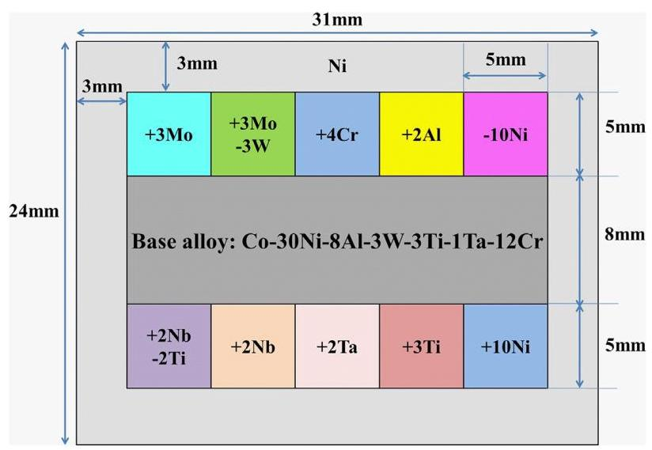
# Fig. 1. Cross-sectional schematic of the designed multicomponent diffusion-multiple.

### Compositional measurement and microstructure characterization of the multicomponent diffusion-multiple

After aging at 850 °C for 1000 h, the diffusion-multiple was cut into two parts parallel to the two Ni caps. Standard metallographic procedures were used to prepare the cut surface for compositional measurement and microstructural observation according to the ASTM E3-11 standard. A JEOL JXA-8230 electron probe micro-analyzer (EPMA) was used to quantitatively and continuously measure the composition 200 μm from the diffusion interface on both sides. For the γ / γ′ two-phase region in the diffusion couple, the EPMA beam spot was set to a circular diameter of 5 μm to determine the average composition of the local area, as shown on the left side of the supplementary Fig. S2. While for the area where there were deleterious secondary phases, the EPMA beam spot was a ${1\mu }\mathrm{m} \times {48\mu }\mathrm{m}$ rectangle with a step size of 5 μm in order to avoid a jump in the compositions, as shown on the right side of the supplementary Fig. S2. A total of 81 EPMA "points" were collected across and perpendicular to the each diffusion interface.

The microstructure at the diffusion interface was characterized by a ZEISS SUPRA 55 field-emission scanning electron microscope (FESEM) equipped with an ATLAS large-area imaging software. The microstructural parameters including the volume fraction, size and roundness of γ′ precipitates were measured by the Image J software [50]. The definition of the roundness of γ′ precipitates is shown in the supplementary Fig. S3.

Phase identification was performed using a FEI Talos transmission electron microscope (TEM) operating at 200 kV and equipped with super energy dispersive X-ray spectroscopy (EDS) and high angle annular dark field (HAADF) detector. TEM samples were extracted using a dual-beam focused ion beam (FIB) instrument system (FEI Helios Nanolab 600i).

### Machine learning

The compositional content of the alloys were selected as the input features for machine learning. Machine learning models on the relationship between the compositions and the microstructural parameters of each alloy after aging at 850 °C for 1000 h were established based on the datasets obtained from the multicomponent diffusion-multiple, containing a total of 1053 compositions and their corresponding phase equilibrium, γ′ volume fraction, γ′ size and roundness. In addition, a machine learning model on the composition and γ′ solvus temperature relationship was also established based on data collected by our group and that which can be found in literatures.

According to the no free lunch (NFL) theorem [51], five different machine learning algorithms were employed for each model. For the classification model of the phase equilibrium, Gradient Boosting Decision Tree (GBDT), Random Forest (RF), K Nearest Neighbor (KNN), Logistic Regression (LR) and Deep Neural Network (DNN) were selected. For the regression models of the γ′ volume fraction, γ′ size, γ′ roundness and γ′ solvus temperature, GBDT, RF, linear regression model (Lin), DNN and support vector regression (SVR) with a radial basis function kernel were selected. A grid-search technique was used to optimize the hyperparameters of each algorithm for the machine learning models. The performance of each model using different algorithms was evaluated by the 10-fold cross-validation method. The Macro-F1 score was used to evaluate the binary classification model $\left({\gamma + {\gamma }^{\prime }}\right.$ two-phase or not), while the root-mean-square error (RMSE) was used to evaluate the performance of the regression models. The better the prediction of the model, the closer the value of Macro-F1 becomes to 1, and the value of RMSE becomes smaller. Finally, the GBDT algorithm was chosen to establish the models for the phase equilibrium and γ′ solvus temperature, and the SVR algorithm was chosen to establish the models for the γ′ volume fraction, γ′ size and γ′ roundness, based on the prediction performance of above models shown in Fig. S4.

After building the machine learning models, the prediction performance of the SVR model for the γ′ volume fraction, γ′ size and γ′ roundness and the GBDT model for the γ′ solvus temperature were evaluated, as shown in Fig. S5. It can be seen that the established machine learning models have high prediction accuracy for both training and testing data sets, with relative error within 3%-11%.

When using the established machine learning models to design alloys, first, the phase equilibrium, γ′ volume fraction, γ′ size, γ′ roundness and γ′ solvus temperature of the alloys in a certain composition space were predicted, and then the related design criteria were used for screening. The phase equilibrium $\left({\gamma + {\gamma }^{\prime }}\right.$ two-phase), γ′ volume faction (45%~60%), γ′ size ($\leq {200}$ nm), γ′ solvus temperature $\left({{1000}^{ \circ }\mathrm{C} \sim {1100}^{ \circ }\mathrm{C}}\right)$ as well as the oxidation resistance (Al+Cr≥22 at.%) and alloy density $\left({ \leq {8.5}\mathrm{\;g}/{\mathrm{{cm}}}^{3}}\right)$ were used to screen the candidate compositions in order to guarantee γ / γ′ two-phase microstructure, reasonable γ′ microstructural parameters (strength and coarsening) and γ′ solvus temperature (hot processing window), as well as good oxidation resistance and low density of the selected alloys. Then the selected alloys were categorized into spherical (Roundness>0.77, lower γ / γ′ lattice misfit) and cuboidal (0.70<Roundness<0.72, higher γ / γ lattice misfit) γ′ precipitates, respectively. Finally, the γ′ volume fraction and the γ′ size were further used to optimize the selected alloys with spherical γ′ morphology. Alloys possessing relatively high volume fractions and small sizes (low coarsening rates) of γ′ precipitates are selected and validated as these alloys should have good mechanical properties and degrade slowly. The γ′ formers (Al+Ti+Ta+Nb+0.5W), γ′ strengthening elements (Ti+Ta+Nb) and solid solution strengthening elements (W+Mo+Cr) were further used to optimize the selected alloys with cuboidal γ′ morphology for better mechanical properties.

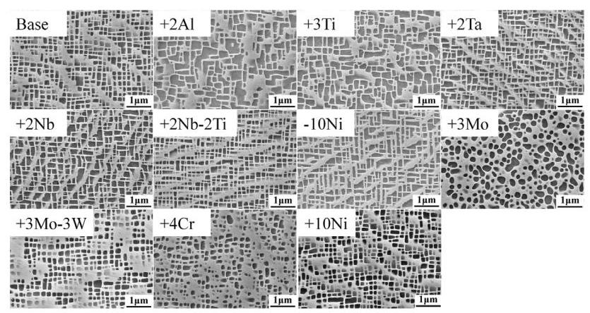
# Fig. 2. Typical microstructures of the alloys in the investigated multicomponent diffusion-multiple after annealing at 850 °C for 1000 h.

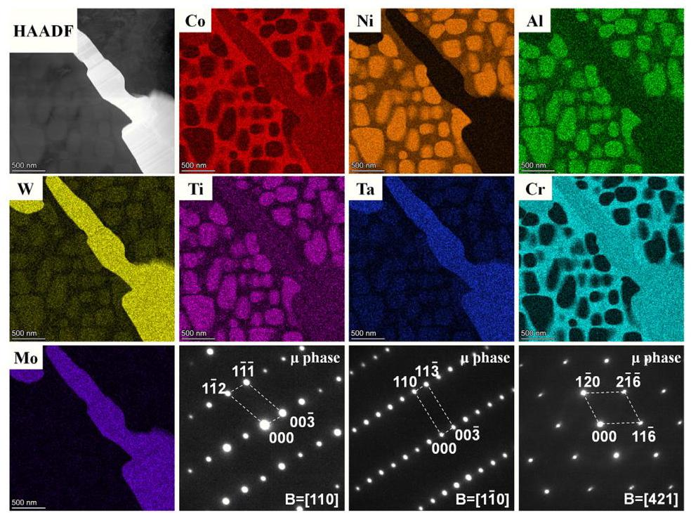
# Fig. 3. STEM-HAADF image, elemental mapping, and selected area diffraction patterns (SADP) for the secondary phase observed in alloy +3Mo after annealing at 850 °C for 1000 h.

### Preparation and characterization of validating alloys

The model alloys used for validation $({200}\mathrm{\;g}$ per alloy) of the machine learning models were melted from high purity metals via arc melting under an Ar atmosphere. After casting, the ingots were placed in quartz tubes with some Ta foils and back-filled with Ar gas to further avoid oxidation. All the alloys were then homogenized at 1200 °C for 24 h with air cooling and aged at 850 °C for 1000 h with water cooling to validate the predicted values of the machine learning models. The compositions of the validation alloys were measured using the JEOL EPMA. The γ′ solvus temperatures were measured using a NETZSCH STA 449C differential scanning calorimetry (DSC) with a heating rate of 10 °C/min. The microstructures were observed by a ZEISS SUPRA 55 FESEM in secondary electron (SE) mode. Samples were chemically etched in a solution of ${33}\% {\mathrm{{HNO}}}_{3} + {33}\% {\mathrm{{CH}}}_{3}\mathrm{{COOH}} + {33}\% {\mathrm{H}}_{2}\mathrm{O} + 1$% HF (volume ratio). The volume fraction, size and roundness of γ′ precipitates were measured by the Image J software, using at least 5 images in different locations to obtain significant statistics.

Atom probe tomography (APT) was used to investigate the partitioning behavior between the γ and γ′ phases after aging at 850 °C for 1000 h. The sharp APT specimens were prepared using a dual-beam focused ion beam (FIB) instrument system (FEI Helios Nanolab 600i). The APT experiments were carried out using a local electrode atom probe (LEAP 5000XR) system in laser pulse mode at a base temperature of 30 K, with an evaporation rate at ${0.5}\%$, a laser pulse energy of 40 pJ and frequency of 125 kHz. Data analysis was performed using the IVAS 3.8 software.

## Results

### Microstructure of the diffusion couple alloys after long-term aging

Fig. 2 shows the microstructures of all diffusion couple alloys after aging at 850 °C for 1000 h. The insets in the upper right corners show the grain boundary microstructure of the respective alloy, if it formed deleterious secondary phases. The base alloy remained as a γ / γ′ two-phase microstructure with a small and cuboidal morphology of γ′ precipitates after aging at 850 °C for 1000 h, indicating that the base alloy had a good microstructural stability. The alloy still maintained the γ / γ′ two-phase microstructure after adding or reducing 10 at.% Ni. The γ′ morphology of the alloy +10Ni was cuboidal with slightly rounded corners, while the γ′ morphology of alloy -10Ni (adding Co) was more cuboidal. In addition, it should be pointed out that the γ′ precipitates of alloy -10Ni coarsened and connected more substantially compared to the base and +10Ni alloys. Therefore, it can be inferred that reducing Ni was detrimental to the microstructural stability of the γ / γ′ two-phase.

The addition of 2 at.% AI, 4 at.% Cr, 3 at.% Ti, 2 at.% Ta, 2 at.% Nb or 3 at.% Mo to the base alloy resulted in the precipitation of deleterious secondary phases to different extents, mainly along the grain boundaries, as shown in the inset images in Fig. 2. The precipitation of such secondary phases was most prevalent in alloy +3Mo, which also formed a large amount of intragranular needlelike secondary phases. In order to identify the secondary phase in alloy +3Mo, a TEM foil was prepared via FIB. HAADF-EDS was used to analyze the secondary phase compositions, and the results are provided in Fig. 3. The needle-like secondary phase in alloy +3Mo was mainly enriched in W, Mo and Ta, and was identified from the selected area diffraction pattern (SADP) as the deleterious μ phase. Interestingly, compared with alloy +3Mo (adding Mo), alloy +3Mo-3W (adding Mo and reducing W) can maintain the γ / γ′ two-phase microstructure without the precipitation of the detrimental μ phase. A similar phenomenon was also observed for alloy +2Nb-2Ti when compared with alloy +2Nb.

The γ′ precipitates of alloys +2Al,+3Ti and +3Mo coarsened significantly compared to the base alloy, indicating that Al, Ti and Mo were unfavorable for control of the γ′ coarsening. However, the γ′ size of alloy +3Mo-3W was equivalent to that of the base alloy, indicating that its coarsening was slower compared to alloy +3Mo. Similar behavior was also observed for alloys +2Nb and +2Nb-2Ti. Compared with alloy +2Nb, adding Nb while reducing Ti can decrease the coarsening rate of the γ′ phase, reducing it even below that of the base alloy.

Fig. 4 shows the statistical results of the microstructural parameters of the diffusion couple alloys in Fig. 2, including the volume fraction, size and roundness of the γ′ phase. It can be seen from Fig. 4 (a) that the reduction of Ni (addition of Co) or the addition of Al, Ti, Ta, Nb and Mo can increase the γ′ volume fraction compared to the base alloy. The addition of Al, Ti and Nb leads to the most significant effect, and the γ′ volume fraction is increased by 7.5%, 5.0% and 4.7% per 1 at.% addition respectively, which is related to the fact that these three alloying elements are all strong γ′ formers. However, adding Cr, replacing Ti with Nb or replacing W with Mo led to a decrease of the γ′ volume fraction. In general, the potency for increasing the γ′ volume fraction is in the order: Al>Ti>Nb>Ta>Mo. Fig. 4 (b) shows the statistical results for the γ′ size. The addition of Al, Ti and Mo significantly increased the γ′ size, thus these elements are unfavorable for the control of the γ′ coarsening rate. Addition of 1 at.% Al, Ti and Mo can increase the γ′ size by ${28}\mathrm{\;{nm}},{16}\mathrm{\;{nm}}$ and 13 nm, respectively, with respect to the base alloy. On the other hand, adding Cr or substituting Nb for Ti can decrease the γ′ size and slow down the γ′ coarsening rate to a certain extent. In general, the potency for increasing the γ′ size is in the order: Al>Ti>Mo>Nb>Ta. Fig. 4 (c) shows the morphology characteristics (roundness) of the γ′ precipitates. Compared with the base alloy, the addition of Ni, Cr, Mo or the replacement of W with Mo can significantly increase the γ′ roundness, that is, cause the γ′ precipitates to be more spherical. On the other hand, the reduction of Ni (adding Co) or the addition of Al, Ti, Ta and Nb will decrease the γ′ roundness, namely, promote the directional coarsening of γ′ precipitates. Among the alloying elements, the reduction of Ni (adding Co) shows the most potent effect. In general, the order of improving the roundness of the γ′ phase is Mo > Cr > Ni.

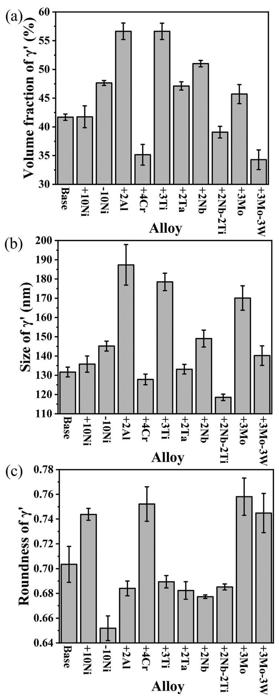
# Fig. 4. Microstructural parameters of γ′ precipitates in the investigated multicomponent diffusion-multiple alloys after annealing at 850 °C for 1000 h. (a) Volume fraction, (b) Size and (c) Roundness.

As a whole, it is possible to qualitatively recognize the effect of each alloying element on the microstructural stability of the γ / γ′ two-phase in the multicomponent CoNi-based superalloys by investigating the microstructures of each diffusion couple alloy. For example, Mo significantly promotes the precipitation of harmful secondary phases; Al, Ti and Nb effectively increase the γ′ volume fraction; Al, Ti and Mo accelerate the coarsening of γ′ phase; while Mo, Cr and Ni alter the morphology and promote roundness of γ′ precipitates. However, the above results are derived from independent alloys and only qualitative knowledge can be extracted, which is of limited help to the alloy design of multicomponent CoNi-based superalloys. In order to obtain more accurate quantitative results, the next section will analyze the relationship between the alloy compositions and the microstructure of the diffusion couples.

### Microstructural and compositional analyses of the multicomponent diffusion-multiple

For demonstration purpose, we take the base-+3Mo diffusion couple as an example for studying the effect of the solid solution strengthening element Mo, shown in Fig. 5. The information of other diffusion couples is shown in the supplementary Fig. S6. Fig. 5 (a) shows the microstructure 200 μm on both sides from the base-+3Mo diffusion interface after annealing at 850 °C for 1000 h. The left side is the base alloy, and the right side is alloy +3Mo. The position where the distance is 0 represents the initial interface of the diffusion couple, and the position where the μ phase starts to precipitate is 5 μm in the direction from the base alloy to alloy $+ 3\mathrm{{Mo}}$. The left side of the position at 5 μm shows the γ + γ′ two-phase microstructure, while the right side of the position at 5 μm shows the γ + γ′ $+ \mu$ three-phase microstructure. Higher magnification of the microstructures at 100 μm intervals are also shown in Fig. 5 (b-f). It is clear that the microstructure changes significantly from the base alloy to the alloy +3Mo.

Fig. 6 shows the EPMA composition profile and the corresponding microstructural parameters for the base-+3Mo diffusion couple after annealing at 850 °C for 1000 h. In Fig. 6 (a), the Mo (Co) content gradually increases (decreases), while the other elements remain basically unchanged from the base alloy to alloy +3Mo (from left to right). Therefore, it can be considered that the microstructural evolution in the base-+3Mo diffusion couple was mainly caused by the variation of the Mo and Co contents. Fig. 6 (b) shows the specific evolution of the volume fraction, size and roundness of γ′ precipitates with the variation of the Mo and Co contents. Microstructural parameters of γ′ precipitates of the base-+3Mo diffusion couple gradually increase, and then decrease and stabilize with the increase of Mo content.

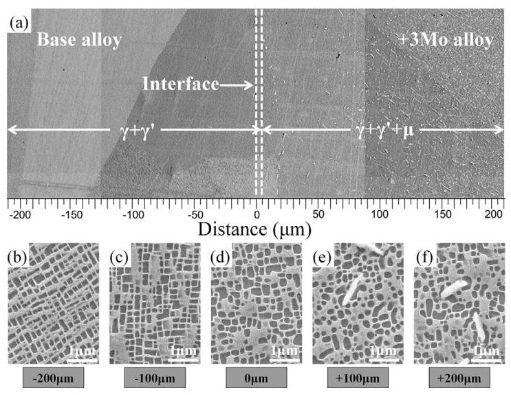
# Fig. 5. (a) Gradient microstructure in the Base-+3Mo diffusion couple after annealing at 850 °C for 1000 h. (b-f) Enlarged images of locations at (b) $- {200\mu }\mathrm{m}$,(c) -100 μm,(d) 0 μm,(e) 100 μm and (f) 200 μm in the base-+3Mo diffusion couple.

Based on the results in Figs. 5 and 6, the microstructure gradually transitions from the γ + γ′ two-phase region to the γ + γ′ $+ \mu$ three-phase region with the increase of Mo content, and μ phase starts to precipitate at 1.43 at.% Mo (at 5 μm). Hence, in order to ensure microstructural stability, the Mo content should not exceed 1.43 at.% on the basis of the base alloy. The Mo content of alloy +3Mo is considerably higher than this critical value, resulting in a large number of μ phase precipitates (alloy +3Mo in Fig. 2). Simultaneously, as the Mo content steadily increases from 0 to 1.43 at.%, the γ′ volume fraction increases slightly, from 42.8% to 45.9%, while the γ′ size and roundness increase significantly, from 142 nm to 170 nm, and from 0.67 to 0.74, respectively. This trend is consistent with the statistical results of alloy +3Mo in Fig. 4, that is, Mo has a limited effect on increasing the γ′ volume fraction, but significantly increases the size and roundness of the γ′ precipitates. Further, when the content of Mo exceeds 1.43 at.%, the volume fraction, size and roundness of the γ′ precipitates gradually reach a peak, and then decrease and stabilize as the Mo content reaches a stable value (~3 at.%).

By characterizing and analyzing the compositions and mi-crostructures of the other 12 diffusion couples (Fig. S6), a total of 1053 compositions and their corresponding phase equilibrium, γ′ volume fraction, γ′ size and γ′ roundness were obtained. This is equivalent to fabricating 1053 CoNi-based superalloys and obtaining their corresponding microstructures. Fig. 7 shows the distribution of γ′ microstructural parameters only for the compositions that have a γ / γ′ two-phase in the multicomponent diffusion-multiple. The volume fraction and the size of γ′ precipitates are generally in a positive correlation with different γ′ morphologies (roundness), that is, the higher the γ′ volume fraction, the larger the γ′ size (Fig. 7(b)). The roundness and the volume fraction of γ′ precipitates have a negative correlation (Fig. 7(c)), and the roundness and size of γ′ precipitates have little correlation (Fig. 7(d)). Generally, a high γ′ volume fraction and low γ′ coarsening rate are desired for good mechanical performance and stability. It can be seen from Fig. 7(a) that compositions meeting this criteria are basically ones that result in a roundness of less than 0.72 (blue and cyan balls), where the γ′ morphology is cuboidal. Whereas compositions resulting in spherical γ′ precipitates (green and red balls), also result in a relatively low γ′ volume fraction, especially for large γ′ size (red balls).

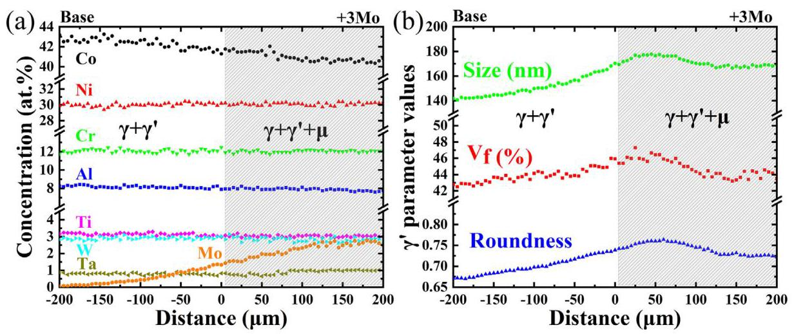
# Fig. 6. The experimental concentration profiles (a) and corresponding volume fraction, size and roundness of γ′ precipitates (b) as a function of diffusion distance in the Base-+3Mo diffusion couple after annealing at 850 °C for 1000 h.

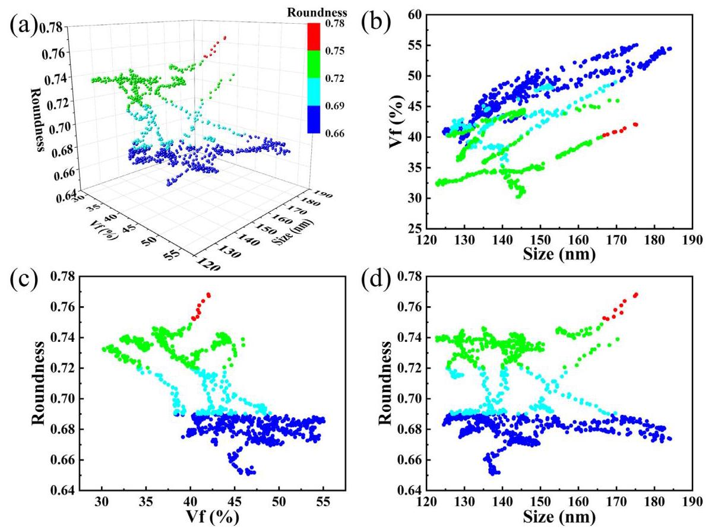
# Fig. 7. The distribution of γ′ volume fraction, size and roundness from all γ / γ′ two-phase compositions in the diffusion couples after annealing at 850 °C for 1000 h. (a) Three-dimensional distribution, (b) projection of the point cloud to the volume fraction and size plane, (c) projection of the point cloud to the roundness and volume fraction plane, (d) projection of the point cloud to the roundness and size plane.

### Machine learning modeling of the alloying effects

Several machine learning models for the relationship between the alloy compositions and microstructural parameters were established based on the quantitative data obtained from the multicomponent diffusion-multiples, i.e. the phase equilibrium, γ′ volume fraction, γ′ size and γ′ roundness. It should be point out that the data used to establish the γ′ parameter models were from alloy compositions that possessed only a γ / γ′ two-phase microstructure, that is, the data shown in Fig. 7. Fig. 8 shows the feature importance of alloying elements on the aforementioned microstructural parameters predicted by the GBDT and RF models. Co, W and Mo have relatively higher feature importance on the phase equilibrium; Al, W, Ti, Cr and Mo have relatively higher feature importance on the γ′ volume fraction; Al, Ti and Mo have higher feature importance on the γ′ size; and Co, Ni, Cr and Mo have higher feature importance on the γ′ roundness. Overall, the established machine learning models are reasonable in estimating the effect of alloying elements according to the phase equilibrium of the diffusion couple alloys shown in Fig. 2 and the alloying effects on the γ′ microstructural parameters in Fig. 4.

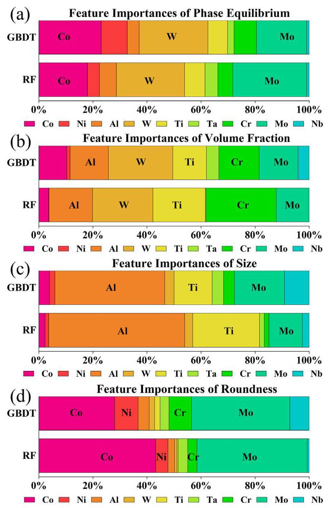
# Fig. 8. Feature importance predicted by the GBDT and RF models for (a) phase equilibrium (b) γ′ volume fraction,(c) γ′ size and (d) γ′ roundness, respectively.

The machine learning models for the phase equilibrium, γ′ volume fraction, γ′ size and γ′ roundness can then be used to investigate the individual and synergistic effects of each alloying element on the microstructure of the CoNi-based superalloys with high Cr content within the compositional range of the multicomponent diffusion-multiple (Fig. 1), and Fig. 9 shows such predictions. Only key elements are shown for demonstration purpose, e.g. Al and Cr, which are important for oxidation resistance [7-9], the γ′ strengthening elements Ti, Nb and Ta [52], and the solid solution strengthening elements W and Mo [53].

Fig. 9 (a, b, c) shows the predictions of the SVR models for the effects of Al and Cr on the γ′ volume fraction, γ′ size and γ′ roundness in the Co-30Ni-xAl-3W-3Ti-1Ta-yCr alloy system. The blank region in the figure is the area where deleterious secondary phases are predicted to form, and hence not areas of interest. The addition of Al under different Cr contents can significantly increase the volume fraction (Fig. 9 (a)) and size (Fig. 9 (b)) of the γ′ precipitates and decrease the γ′ roundness (Fig. 9 (c)). The addition of Cr under different Al contents has the opposite effect. This is consistent with the results on the effects of Al and Cr shown in Figs. 2 and 4, indicating the established machine learning models have high reliability. At the same time, with the decrease of Cr content and the increase of Al content (from upper left corner to lower right corner), the γ′ volume fraction, size and roundness change significantly due to their synergistic effect. More interesting is that the volume fraction and size of γ′ precipitates can remain basically unchanged through the concurrent additions of Al and Cr to the Co-30Ni-8Al-3W-3Ti-1Ta-12Cr alloy, simultaneously resulting in more cuboidal and regular γ′ precipitates (γ′ roundness closer to 0.71), and improving the oxidation resistance of the alloy (higher Al and Cr contents).

Fig. 9 (d, e, f) shows the effect of Ti and Nb predicted by the SVR models on the γ′ microstructural parameters in the Co-30Ni- 8Al-3W-xTi-1Ta-12Cr-yNb alloy system. Similar to Al and Cr, excessive addition of Ti and Nb will trigger the precipitation of secondary phases, and the addition of Nb has a more potent effect compared to that of Ti. The addition of Ti and Nb can significantly increase the volume fraction (Fig. 9 (d)) and size (Fig. 9 (e)) of γ′ precipitates - the effect of Ti is slightly more pronounced. Both alloying elements decrease the γ′ roundness (Fig. 9 (f)), resulting in more elongated and irregular γ′ phase, with Nb showing a more pronounced effect. The above results are again consistent with the results in Figs. 2 and 4. On the other hand, if Ti is used to replace Nb, the volume fraction, size and roundness of γ′ precipitates remains unchanged, and the cost and density of the alloy can be reduced.

Fig. 9 (g, h, i) shows the effect of Ta and Nb predicted by the SVR models on the γ′ microstructural parameters in the Co-30Ni- 8Al-3W-3Ti-xTa-12Cr-yNb alloy system. Similar to Ti and Nb, the addition of Ta will also increase the volume fraction (Fig. 9 (g)) and size (Fig. 9 (h)), and decrease the roundness (Fig. 9 (i)) of γ′ precipitates, but these effect are less potent compared to that of Nb. For instance, at 1.0 at.% Ta, when increasing Nb from 0 to 1.0 at.%, there will be increase in γ′ volume fraction of 4.9% (from 43.5% to 48.4%) and size of 9nm (from 136nm to145nm); at 1.5 at.% Ta, when increasing Nb from 0 to 1.0 at.% Nb, there will be an increase of 5.3% (from 44.5% to 49.8%) in volume fraction and 12nm (from 136nm to148nm) in size; and finally when adding 0.5 at.% Nb and 0.5 at.% Ta to go from 0 at.% Nb and 1.0 at.% Ta to 0.5 at.% Nb and 1.5 at.% Ta, there will be an increase in volume fraction of 3.6% (from 43.5% to 47.1%) and in size of 5nm (from 136nm to141nm). In each of these cases, although 1 at.% of γ′ forming elements is added (and for the first two cases only Nb is added in the same amount at different levels of Ta), the change in volume fraction, size and roundness are different, showing that there are clear synergistic effects between Nb and Ta. Such effects could be further extended to all other elements, which highlights the extended capability the presented framework would have in terms of exploring synergistic effects, over the more traditional trial and error approach to alloying.

Fig. 9 (j, k, l) shows the effect of W and Mo predicted by the SVR models on the γ′ microstructural parameters in the Co-30Ni- 8Al-xW-3Ti-1Ta-12Cr-yMo alloy system. Again, excessive addition of W or Mo will lead to the precipitation of secondary phases, with Mo showing a higher potency compared to W. The addition of W can significantly increase the γ′ volume fraction (Fig. 9 (j)), while the addition of Mo has only a slight effect. Both W and Mo are prone to increase the γ′ size (Fig. 9 (k)), with Mo showing a significantly higher effect than W, which is detrimental to the control of the γ′ coarsening rate. Nevertheless, within a certain composition range (~2.5 at.%), replacing W with Mo can effectively alter the morphology (Fig. 9 (l)) of the γ′ precipitates and reduce the density of the alloy while keeping the volume fraction and size of γ′ phase basically unchanged.

### Alloy design and validation

Although the above predicted individual and interactive effects of the alloying elements represent important guidelines for alloy design, it still remains difficult to obtain specific microstructural parameters by only changing one or two alloying elements. Indeed, multiple, if not all, alloying additions need to be adjusted synchronously in order to achieve target microstructural parameters. Therefore, the established machine learning models were further used to predict the microstructures of alloys in a certain composition space and then extract the alloys that possess a target microstructure and other key properties.

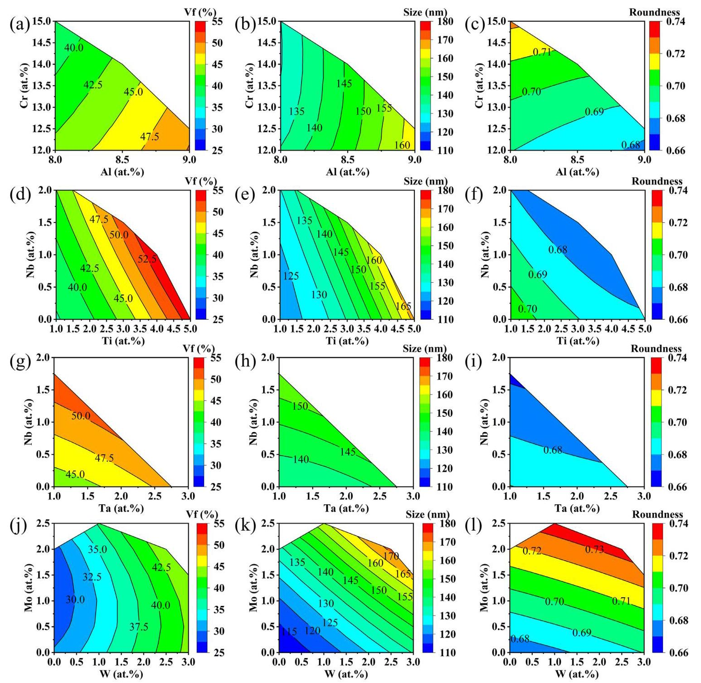
# Fig. 9. Effects of (a, b, c) AI and Cr,(d, e, f) Ti and Nb,(g, h, i) Ta and Nb,(j, k, l) W and Mo on the γ′ volume fraction (a, d, g, j), size (b, e, h, k) and roundness (c, f, i, l) in the Co-Ni-Al-W-Ti-Ta-Cr-Mo-Nb system predicted by machine learning models.

In this work, the defined design space for the multicomponent CoNi-based alloys with high Cr content is shown in Table 2, where a total of 393750 unknown compositions need to be evaluated. The designated compositional space of each element does not exceed the lower and upper limits of diffusion couple alloy in the multicomponent diffusion-multiple (Fig. 1). Thus, the predictions of the machine learning models do not involve a substantial extent of extrapolation. All alloys predicted by the machine learning models are filtered by the phase equilibrium $\left({\gamma + {\gamma }^{\prime }}\right.$ two-phase), γ′ volume faction (45% $\sim {60}\%$), γ′ size $\left({ \leq {200}\mathrm{\;{nm}}}\right),{\gamma }^{\prime }$ morphology (spherical or cuboidal), γ′ solvus temperature $\left({{1000}^{ \circ }\mathrm{C} \sim {1100}^{ \circ }\mathrm{C}}\right)$ as well as the oxidation resistance (Al+Cr≥22 at.%) and alloy density $\left({ \leq {8.5}\mathrm{\;g}/{\mathrm{{cm}}}^{3}}\right)$ criteria.

# Table 2 The design space of multicomponent CoNi-based alloys (at.%).
<table><tr><td>Elements</td><td>Co</td><td>Ni</td><td>Al</td><td>W</td><td>Ti</td><td>Ta</td><td>Cr</td><td>Mo</td><td>Nb</td></tr><tr><td>Lower limit</td><td>Bal.</td><td>30</td><td>8</td><td>1</td><td>1</td><td>1</td><td>12</td><td>0</td><td>0</td></tr><tr><td>Upper limit</td><td>Bal.</td><td>32</td><td>10</td><td>3</td><td>3</td><td>3</td><td>16</td><td>3</td><td>2</td></tr><tr><td>Step size</td><td>-</td><td>2</td><td>0.5</td><td>0.5</td><td>0.5</td><td>0.5</td><td>0.5</td><td>0.5</td><td>0.5</td></tr></table>

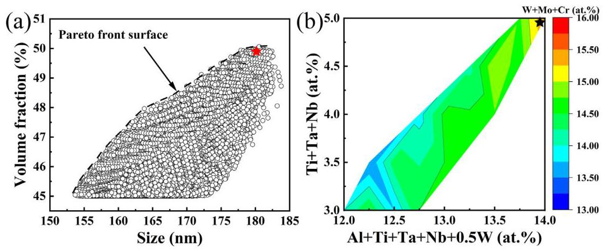
# Fig. 10. (a) Scatter diagram (Volume fraction vs. size) for the alloys with spherical γ′ precipitates (Roundness>0.77) and (b) distribution diagram for the total content of γ′ formers (Al+Ti+Ta+Nb+0.5W), γ′ strengthening elements (Ti+Ta+Nb) and solid solution strengthening elements (W+Mo+Cr) of the alloys with cuboidal γ′ precipitates $\left({{0.70} \times \text{ Roundness } \times {0.72}}\right)$ after screening with various criteria in the Co-Ni-Al-W-Ti-Ta-Cr-Mo-Nb system predicted by machine learning models. Two selected alloys for validations are also shown (stars symbols).

# Table 3 Nominal and measured (by EPMA) compositions (at.%) of the selected alloys.
<table><tr><td colspan="2">Alloys</td><td>Co</td><td>Ni</td><td>Al</td><td>W</td><td>Ti</td><td>Ta</td><td>Cr</td><td>Mo</td><td>Nb</td></tr><tr><td rowspan="2">A1</td><td>nominal</td><td>bal.</td><td>32.0</td><td>9.0</td><td>2.0</td><td>1.0</td><td>1.0</td><td>14.0</td><td>2.5</td><td>0.5</td></tr><tr><td>measured</td><td>bal.</td><td>33.8±0.1</td><td>8.7±0.1</td><td>2.1±0.1</td><td>1.0±0.1</td><td>0.9±0.1</td><td>13.5±0.2</td><td>2.1±0.1</td><td>0.3±0.1</td></tr><tr><td rowspan="2">A2</td><td>nominal</td><td>bal.</td><td>30.0</td><td>8.0</td><td>2.0</td><td>2.5</td><td>1.5</td><td>14.0</td><td>-</td><td>1.0</td></tr><tr><td>measured</td><td>bal.</td><td>30.0±0.2</td><td>8.2±0.1</td><td>2.0±0.1</td><td>2.7±0.1</td><td>1.3±0.1</td><td>14.2±0.2</td><td>-</td><td>0.9±0.1</td></tr></table>

However, this filtration of alloys still results in a large amount of candidate alloys. In order to design alloys with good properties, the optimized alloys with spherical γ′ morphology are plotted on a volume fraction vs. γ′ size diagram as shown in Fig. 10 (a). From the perspective of microstructural design, the designed alloys are expected to have high volume fractions and small sizes (low coarsening rates) of γ′ precipitates, so that the alloys will have decent mechanical properties and degrade slowly. Therefore, the candidate alloys can be further optimized from the Pareto front surface of volume fraction vs. γ′ size, shown as the dotted line in Fig. 10 (a). For the optimized alloys with cuboidal γ′ morphology, although the Pareto front surface of volume fraction vs. γ′ size can also be obtained, there are still many candidate alloys on that front surface. Therefore, we further plot a distribution diagram of the strengthening elements, such as γ′ formers (Al+Ti+Ta+Nb+0.5W), γ′ strengthening elements (Ti+Ta+Nb) and solid solution strengthening elements (W+Mo+Cr), of the alloys with cuboidal γ′ morphology, as shown in Fig. 10 (b). For superior mechanical properties, the final candidate alloys were chosen such that they are within the region of maximum of those three types of elements.

In order to validate the accuracy of the machine learning models, two alloys - one with spherical and one with cuboidal γ′ morphology - were selected shown as stars in Fig. 10 (a) and (b), respectively. The nominal and measured compositions of the selected alloys are shown in Table 3. Alloy A1 has a higher content of Mo, which mainly ensures a spherical γ′ morphology. Alloy A2 does not contain Mo, but has a high Ti, Ta and Nb content, since the γ′ morphology should be cuboidal.

Fig. 11 shows the microstructures of the selected alloys after aging at 850 °C for 1000 h. No secondary phases were precipitated on the grain boundaries, indicating that alloys A1 and A2 have decent microstructural stability and that the prediction accuracy of the machine learning model for the phase equilibrium is sufficiently good. The γ′ morphologies of alloys A1 and A2 are spherical and cuboidal respectively, which is again consistent with the machine learning model predictions, as expected. Table 4 lists the predicted and measured γ′ microstructural parameters as well as solvus temperatures of the selected alloys. The machine learning predicted values are close to the experimental values and within the relative errors shown in Fig. S5, indicating that the machine learning model has a relatively high accuracy for the γ′ microstructural parameters and solvus temperature.

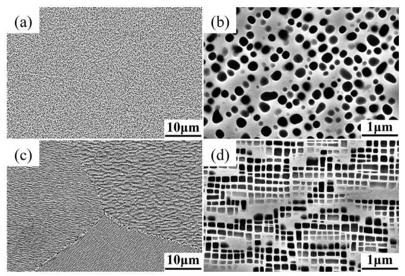
# Fig. 11. Typical microstructures of the alloys (a, b) A1 and (c, d) A2 after annealing at 850 °C for 1000 h. No secondary phases were precipitated along the grain boundaries, indicating decent microstructural stability of the alloys A1 and A2.

Additionally, the γ and γ′ phase compositions of alloys A1 and A2 after aging at 850 °C for 1000 h were analyzed by APT. Figs. 12 and 13 show the 3D reconstruction results and the corresponding compositional profiles (via a proxigram [54]) across the γ / γ′ interfaces for alloys A1 and A2, respectively. Table 5 lists the γ and γ′ phase compositions and the partitioning coefficients $\left({\mathrm{K}}_{{\gamma }^{\prime }/\gamma }\right)$ of each alloy. It is evident that Co, Cr and Mo partition strongly to the γ matrix. The Cr, in particular, partitions very strongly, resulting in partitioning coefficients 0.18 and 0.19 in alloys A1 and A2, respectively. Ni, Al, W, Ti, Ta and Nb partition to the γ′ precipitates to different extents. The partitioning of Ta is strongest with coefficients of 8.58 and 8.50 in alloys A1 and A2, respectively. Although a high Ni content (~30 at.%) was added and the W content was also decreased to a low level ($\sim 2$ at.%), W still tend to partition to the γ′ phase, with the partitioning coefficients of 1.16 and 1.28 in alloys A1 and A2, respectively.

# Table 4 Comparison of predicted and measured γ′ microstructural parameters and solvus temperatures of the selected alloys.
<table><tr><td colspan="2">Alloys</td><td>${\mathrm{V}}_{\mathrm{f}}\left(\% \right)$</td><td>Size (nm)</td><td>Roundness</td><td>γ′ solvus $\left({{}^{ \circ }\mathrm{C}}\right)$</td></tr><tr><td rowspan="2">A1</td><td>Predicted</td><td>49.9</td><td>179</td><td>0.77</td><td>1064</td></tr><tr><td>Measured</td><td>45.7±1.8</td><td>189±67</td><td>0.81±0.11</td><td>1050</td></tr><tr><td rowspan="2">A2</td><td>Predicted</td><td>45.6</td><td>126</td><td>0.70</td><td>1097</td></tr><tr><td>Measured</td><td>49.0±2.6</td><td>139±55</td><td>0.71±0.18</td><td>1095</td></tr></table>

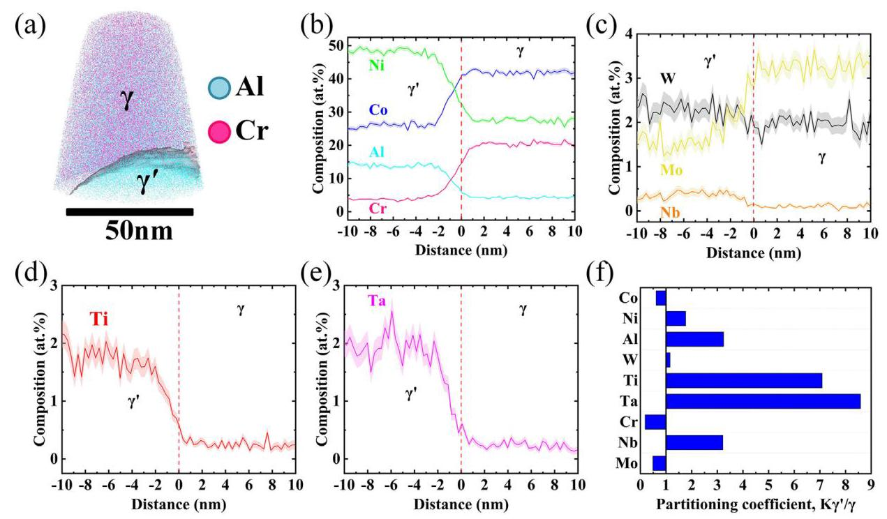
# Fig. 12. (a) APT reconstruction with a 14 at% cr isocomposition surface highlighted to illustrate the γ′ precipitates and (b, c, d, e) composition profile across the $\gamma \mid {\gamma }^{\prime }$ interface derived using the proxigram approach. (d) Partitioning coefficients between the γ′ and γ phases $\left({K}_{{\gamma }^{\prime }/\gamma }\right)$ of alloy A1 after annealing at 850 °C for 1000 h.

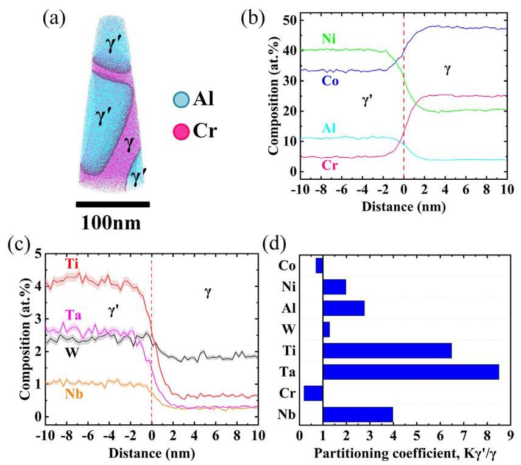
# Fig. 13. (a) APT reconstruction with the 14 at.% Cr isocomposition surface highlighted to illustrate the γ′ precipitates and (b, c) composition profile across the γ / γ′ interface derived using the proxigram approach. (d) Partitioning coefficients between γ′ and γ phases $\left({\mathrm{K}}_{{\gamma }^{\prime }/\gamma }\right)$ of alloy A2 after annealing at 850 °C for 1000 h.

## Discussion

In this work, we explored the relationship between composition and microstructures in the multicomponent CoNi-based superalloys with high Cr content using an integrated high-throughput multicomponent diffusion-multiple and machine learning approach. The multicomponent diffusion-multiples provide a large amount of experimental data from a single sample, and significantly improve the understanding of the alloying effects on the microstructure of a given base alloy. Subsequently, machine learning can effectively exploit the relationship between composition and microstructure to accelerate the design of alloys with the target microstructures, that would translate to good high-temperature mechanical properties.

# Table 5 The γ / γ′ compositions (at%) and the partitioning coefficients ${\mathrm{K}}_{{\gamma }^{\prime }/\gamma }$ between γ′ and γ phases in the alloys A1 and A2 after aging at 850 °C for 1000 h.
<table><tr><td rowspan="2"></td><td colspan="3">A1</td><td colspan="3">A2</td></tr><tr><td>γ′</td><td>γ</td><td>${\mathbf{K}}_{{\gamma }^{\prime } \mid \gamma }$</td><td>γ′</td><td>γ</td><td>${\mathbf{K}}_{{\gamma }^{\prime } \mid \gamma }$</td></tr><tr><td>Co</td><td>25.61±0.72</td><td>41.81±0.75</td><td>0.61</td><td>33.34±0.34</td><td>47.45±0.26</td><td>0.70</td></tr><tr><td>Ni</td><td>48.70±0.76</td><td>27.56±0.66</td><td>1.77</td><td>40.36±0.31</td><td>20.40±0.23</td><td>1.98</td></tr><tr><td>Al</td><td>13.92±0.58</td><td>4.29±0.33</td><td>3.24</td><td>11.13±0.23</td><td>4.02±0.10</td><td>2.77</td></tr><tr><td>W</td><td>2.32±0.23</td><td>2.01±0.20</td><td>1.16</td><td>2.36±0.10</td><td>1.84±0.07</td><td>1.28</td></tr><tr><td>Ti</td><td>1.78±0.19</td><td>0.25±0.08</td><td>7.09</td><td>4.17±0.14</td><td>0.64±0.04</td><td>6.48</td></tr><tr><td>Ta</td><td>1.92±0.20</td><td>0.22±0.07</td><td>8.58</td><td>2.65±0.11</td><td>0.31±0.03</td><td>8.50</td></tr><tr><td>Cr</td><td>3.75±0.29</td><td>20.41±0.56</td><td>0.18</td><td>4.81±0.16</td><td>24.98±0.26</td><td>0.19</td></tr><tr><td>Nb</td><td>0.36±0.09</td><td>0.11±0.06</td><td>3.22</td><td>1.04±0.07</td><td>0.26±0.03</td><td>3.98</td></tr><tr><td>Mo</td><td>1.59±0.22</td><td>3.28±0.23</td><td>0.49</td><td>-</td><td>-</td><td>-</td></tr></table>

### Alloying effects on the γ / γ microstructure

#### Phase equilibrium

The addition of alloying elements is primarily to strengthen the γ matrix or γ′ precipitates, thereby improving the high temperature mechanical properties of the alloy. However, when alloying additions exceed the solubility of γ matrix, it is possible to promote the precipitation of deleterious secondary phases, which generally decrease the microstructural stability and ultimately damage the mechanical properties of the alloy [22]. Research on Co-Al-W-based alloys has shown that the addition of Nb, Ta, Mo and Cr can easily promote the precipitation of W-rich μ phase and χ phase due to the narrow γ / γ′ two-phase region [5,11,31,55], the addition of Ti can easily promote the precipitation of Al-rich β phase [5,55], while the addition of Ni can effectively expand the γ / γ′ two-phase region and improve the microstructural stability of the alloy [3]. In CoNi-based alloys, although the γ / γ′ two-phase region is relatively large due to the addition of Ni, excessive addition of Nb, Ta, Mo and Cr can still promote the precipitation of W-rich μ phase and χ phase [24,25,56,57], while excessive addition of Al and Ti can cause the precipitation of β phase and η phase, respectively [25,58,59].

In the present study, as shown in Fig. 2, there were no detrimental secondary phases formed by adding Ni or reducing Ni on the basis of Co-30Ni-8Al-3W-3Ti-1Ta-12Cr. Adding Al, Cr, Ti, Ta and/or Nb resulted in a minor amount of secondary phase precipitation along the grain boundaries, while the addition of Mo strongly promoted the precipitation of a secondary phase (μ phase in this case), which is detrimental to the microstructural stability. In contrast to the present results, our recent research on CoNi-based alloys without Cr showed that [25], on the basis of Co-20Ni- 7Al-8W-4Ti-1Ta, adding Ta, Nb or Mo while reducing W will lead to the precipitation of W-rich χ phase to different extends. Among these elements, the effect of Nb was the most significant, followed by Ta, and that of Mo was the weakest [25].

The different results of alloying effects in promoting secondary phase precipitation may be related to the W, Cr and Ni contents of the alloys. In Co-20Ni-7Al-8W-4Ti-1Ta, more W is partitioned to the γ′ phase due to the higher W content, lower Ni content and absence of Cr in the alloy [3,57,60]. Therefore, when W is replaced with strong γ′ formers such as Nb and Ta, more Nb and Ta will partition into the γ′ phase. This effectively forces more W to partition to the γ phase, where it is concentrated and leads to the precipitation of a substantial amount of the W-rich χ phase. Conversely, when Mo is used to replace W, less Mo will partition to the γ′ phase due to its weak partitioning behavior and displaces less W to the γ phase, thus resulting in a low W concentration in the γ phase and less precipitation of the W-rich χ phase. However, for the alloy system studied in this paper, due to the high content of Ni and Cr, and the low content of W, the partitioning behavior of W between the γ / γ′ phases is insignificant, that is, the concentration of W in the γ and γ′ phases are comparable, as shown in Table 5. Therefore, when strong γ′ formers such as Nb and Ta are added, their effects on the W concentration in the γ phase are unapparent, and only a minor fraction of secondary phases could be observed mainly along grain boundaries. On the contrary, Mo mainly partitions to the γ phase, based on the γ / γ′ two-phase compositions of alloy A1 (Fig. 12). The addition of Mo can substantially increase the solute concentration of the γ phase, and thus lead to the precipitation of the W/Mo-rich μ phase.

Both W and Mo are effective solid solution strengthening elements, and can efficiently improve the creep properties of Ni-based superalloys [53]. However, they can also easily lead to the precipitation of TCP phases in Ni-based superalloys, with Mo exhibiting a stronger effect than W [61]. W and Mo are also the primary elements affecting the phase equilibrium as evaluated by the feature importance (Fig. 8 (a)). Therefore, special attention should be paid to the addition and optimization of these two elements to CoNi-based alloys, especially with high Cr content, in order to maintain a stable microstructure. From the results of the base-+3Mo diffusion couple, the maximum amount of Mo that can be added to the base alloy is 1.43 at.%. Nevertheless, adding Mo while reducing W can effectively prevent the precipitation of deleterious secondary phases while increasing the overall content of Mo, as shown in the base-+3Mo-3W diffusion couple of the supplementary Fig. S6.

#### Effect on γ′ volume fraction

It is well known that the γ′ phase is the primary strengthening phase of superalloys, and a relatively high γ′ volume fraction is beneficial to the high temperature mechanical properties. In Co-Al-W-based and CoNi-based alloys, the addition of Al, W, Ti, Ta and Nb will increase the γ′ volume fraction [2,4,27,29,30,58,62-64], while the addition of Mo and Cr will decrease it [5,24,30,31,56,57,62,65].

Based on the statistical results of the diffusion couple alloys shown in Fig. 4 (a), the additions of Al, Ti, Ta, Nb, Mo or the decrease of Ni can increase the γ′ volume fraction, while additions of Cr can significantly decrease the γ′ volume fraction. Al, Ti, Ta and Nb are all strong γ′ formers (Figs. 12 and 13), thus the addition of these elements will unsurprisingly increase the γ′ volume fraction. In contrast to other studies in literature [5,30], although Mo is a γ former (Table 5), its addition also increased the γ′ volume fraction in the current study, which may be related to its enhancement of the partitioning behavior of other γ′ formers. Cr is mainly distributed in the γ phase (Figs. 12 and 13), thus its addition will significantly decrease the γ′ volume fraction. It should be noted that replacing W with Mo will further reduce the γ′ volume fraction, which indicates that W can effectively increase the γ′ volume fraction. Indeed, W has a major influence on the γ′ volume fraction and can significantly increase it as predicted by the machine learning model shown in Figs. 8 (b) and 9 (g). Similar phenomena have also been reported in other CoNi-based alloys [26,66,67].

#### Effect on γ′ size

The γ′ size has a significant effect on the mechanical properties of the superalloys. The coarsening of γ′ precipitates at high temperature will gradually degrade the mechanical properties of the superalloys. Therefore, it is meaningful to study the alloying effect on the γ′ size in order to design superalloys with low coarsening rates. In Co-Al-W-based alloys, the γ′ coarsening rate is very slow, which is attributed to the slow diffusivity of W in the γ matrix as a rate-limiting factor [68]. In addition, the replacement of W with Mo can further decrease the γ′ coarsening rate in Co-Al-W-based alloys [13]. However, in multicomponent CoNi-based alloys, primarily due to the addition of Ni, the partitioning behavior of alloying elements is changed, which in turn changes the rate-limiting elements and the γ′ coarsening rates. For instance, the addition of 20 at.% Ni to the Co-7Al-7W ternary alloy could change the rate-limiting element from W to Al, and increase the γ′ coarsening rate due to the faster diffusivity of Al in the γ matrix [69]. The addition of Al or Ti also increases the γ′ coarsening rate in CoNi-based superalloys [27,29,63,64,70]. While, the addition of Cr could decrease the coarsening rate of γ′ precipitates [56,57,71], and our recent study suggests that Cr is the rate-limiting element for the γ′ coarsening rate in CoNi-based superalloys with high Cr content [32].

Although the initial γ′ size may be different due to different γ′ solvus temperature and volume fraction of alloys after the air cooling from 1240 °C, there is a certain relationship between the initial γ′ size and the coarsening rate. According to our recent results [32], an alloy with a larger initial γ′ size typically has a higher coarsening rate of γ′ precipitates, resulting in the larger final γ′ size at 850 °C. Thus, the final γ′ size after aging at ${850}^{ \circ }\mathrm{C}/{1000}\mathrm{h}$ can be used as an indicator for coarsening rate of corresponding alloy composition. Fig. 4 (b) shows that an addition of Al, Ti and/or Mo to the base alloy can significantly increase the γ′ size and accelerate the coarsening rate of the γ′ precipitates. Conversely, the addition of Cr or substituting Nb for Ti can decrease the γ′ size to a certain extent and slow down the coarsening of the γ′ precipitates. The addition of Al and Ti can effectively increase the γ′ volume fraction and the γ / γ′ lattice misfit, resulting in narrower γ channels (shorter diffusion distance) and higher γ / γ′ interfacial energy [32]. In addition, the diffusion coefficients of Al and Ti in the γ matrix are relatively high [72], so the addition of these two elements will significantly enhance the coarsening rate of γ′ precipitates. The effect of Mo on increasing the γ′ coarsening is mainly related to the change of the Cr content in the γ matrix, which will be discussed in the next section. The machine learning model also predicts that Al, Ti and Mo have a high impact on the γ′ size (Fig. 8 (c)), and can significantly increase it (Fig. 9). Therefore, in order to decrease the coarsening rate of the γ′ precipitates, the contents of Al, Ti and Mo need to be carefully balanced.

#### Effect on γ′ morphology

Fig. 4 (c) shows that starting from the base alloy, an addition of Mo, Cr and/or Ni can significantly increase the γ′ roundness, that is, lead to a more spherical γ′ morphology, which is similar to reports on other Co-Al-W-based and CoNi-based alloys [1,4,30,49,56,57,65,73,74]. On the other hand, the decrease of Ni (addition of Co) or the addition of Nb, Ta, Al and Ti can decrease the γ′ roundness to different extents, that is, promote a cuboidal or elongated morphology of γ′ phase. Similar effects of Ti, Ta and Nb have also been reported in other Co-Al-W-based and CoNi-based alloys [1,4,27,30,62-64].

The γ′ morphology is closely related to the γ / γ′ two-phase lattice misfit, δ, which is defined by the lattice parameters of γ and γ′ phases as:

$$
\delta  = \frac{2\left( {{a}_{{\gamma }^{\prime }} - {a}_{\gamma }}\right) }{{a}_{{\gamma }^{\prime }} + {a}_{\gamma }}. \tag{1}
$$

The γ′ morphology tends to be spherical at near-zero lattice misfit and becomes cuboidal with higher absolute values of lattice misfit [75]. The γ / γ′ lattice misfits of similar CoNi-based superalloy compositions are all positive [32]. Therefore, it can be reasonably inferred that the γ / γ′ lattice misfits of the alloys studied in this work should also be positive values, i.e. the γ′ lattice parameter is larger than that of γ phase. From the elemental partitioning results in the γ / γ′ two-phase, as shown in Figs. 12 and 13, Mo and Cr partition to the γ phase, hence their addition will minimize the difference of the γ / γ′ lattice parameters and decrease the lattice misfit. This of course results in more spherical γ′ precipitates. The reason for the spherical γ′ precipitates in the high Ni alloys is that Ni changes the partitioning behavior of other alloying elements. Other studies [3,76] have shown that the addition of Ni promotes the partition of Al to the γ′ phase and W to the γ phase, which leads to a decrease in the difference in the lattice parameters of the γ and γ′ phases, leading to a near spherical morphology of the γ′ precipitates. Meanwhile, the addition of γ′ forming elements Nb, Ta, Al and Ti will have the opposite effect - they will increase the difference of the lattice parameters of the γ / γ′ phases and increase the γ / γ′ lattice misfit, resulting in cuboidal or elongated morphology of γ′ precipitates.

In Ni-based superalloys, however, the addition of Cr and Mo will promote a cuboidal morphology of the γ′ phase [77,78], which is opposite to the finding of the current study. This is related to the negative γ / γ′ lattice misfits of Ni-based superalloys, that is, the γ′ lattice parameter is smaller than that of γ phase. Similar to CoNi-based superalloys, Cr and Mo still partition to the γ phase in Ni-based superalloys [79,80], hence their addition will further increase the difference in lattice parameters of γ and γ′ phases, making the γ / γ′ lattice misfit more negative, i.e. increasing the absolute value of the lattice misfit. Therefore, the addition of Cr and Mo will promote a cuboidal morphology of γ′ precipitates. Additionally, it was reported that the cuboidal morphology of the γ′ phase (large absolute value of the γ / γ′ misfit) is beneficial to improve the creep property of the alloy [81]. For that reason, it can be speculated from the perspective of the γ′ morphology $(\gamma /\gamma$ ’ lattice misfit) that the addition of Cr and Mo may be detrimental to the creep property of CoNi-based alloys with high Cr content.

As a whole, Mo and W are the major elements that affect the phase equilibrium. The addition of Mo individually will strongly promote the precipitation of deleterious secondary phases and accelerate the coarsening of γ′ precipitates. However, adding Mo while reducing W can effectively prevent the precipitation of such secondary phases and decrease the coarsening of γ′ precipitates to some extent. The addition of Al, Ti, Ta, Nb and Cr might lead to the formation of a minor amount of deleterious secondary phases along the grain boundaries, however Al, Ti and Nb will significantly promote the coarsening rate of γ′ precipitates. Ta has little effect on the γ′ coarsening, while Cr can effectively decrease it. The addition or reduction of Ni does not lead to the precipitation of secondary phases, and there is little effect on the coarsening of γ′ phase when Ni is added, however further reducing Ni (adding more Co) will promote γ′ coarsening. From the data shown in Fig. 7, the γ′ volume fraction is positively correlated with the γ′ size, that is, the higher the γ′ volume fraction, the larger the γ′ size, which is problematic for the design of CoNi-based superal-loys with high γ′ volume fraction and small γ′ size. Therefore, it is critical to establish a quantitative relationship model between the alloy composition and the γ / γ′ two-phase microstructure, in order to optimize these parameters simultaneously.

### Features of the designed alloys

Two multicomponent CoNi-based superalloys with a high Cr content were designed through the established machine learning models, and the alloy compositions are shown in Table 3. There were no secondary phases even along the grain boundaries of alloys A1 and A2 after aging at 850 °C for 1000 h (Fig. 11), indicating that they have good microstructural stability. The γ′ morphologies of alloys A1 and A2 were spherical and cuboidal, respectively, which was consistent with the γ′ roundness predicted by the respective machine learning model. The reason for the spherical γ′ morphology of alloy A1 was related to the addition of Mo, with a nominal composition of 2.5 at.%. Meanwhile alloy A2 did not contain Mo, and the content of γ′ forming elements Ti, Ta and Nb was relatively high, leading to a cuboidal γ′ morphology. The γ′ solvus temperature of alloy A2 was 1095 °C (Table 4), which was higher than that of alloy A1 (1050°C). This was related to the high content of Ti, Ta and Nb in alloy A2 since these three alloying elements can significantly increase the γ′ solvus temperature [52].

Although the γ′ morphology of the alloy A1 is spherical with lower γ / γ′ lattice misfit and interfacial energy [30,75,82], the γ′ precipitates of alloy A1 coarsened faster, resulting in significantly larger γ′ size $\left({{189} \pm {67}\mathrm{\;{nm}}}\right)$ after aging at 850 °C for 1000 h, compared to that in alloy A2 (139±55 nm). According to our previous study [32], Cr was determined to be the rate-limiting element for the γ′ coarsening rate, and higher Cr content in the γ matrix or a larger Cr concentration difference across the γ / γ′ interface is helpful for decreasing the coarsening rate of the γ′ precipitates in multicomponent CoNi-based superalloys with high Cr content. Based on the APT composition results of the γ / γ′ two-phase mi-crostructures of alloys A1 and A2 (Table 5), the Cr content in the γ phase of alloy A1 (20.41±0.56 at.%) was lower than that of alloy A2 (24.98±0.26 at.%), and the Cr concentration difference across the γ / γ′ interface of alloy A1 (16.66 at.%) was also smaller than that of alloy A2 (20.17 at.%). This may be attributed to the higher Mo content (3.28±0.23 at.%) in the γ matrix of alloy A1, which leads to a decrease of the Cr content in the γ matrix. This explains the reason as to why the addition of Mo is unfavorable in terms of minimizing the γ′ coarsening rate.

In general, due to the higher content of Mo and lower total contents of Ti, Ta and Nb, alloy A1 possessed spherical γ′ precipitates with a slightly lower volume fraction, larger size, and lower solvus temperature. In contrast, alloy A2, which does not contain Mo and has a higher total content of Ti, Ta and Nb, had cuboidal γ′ precipitates with a slightly higher volume fraction, smaller size, and higher solvus temperature. According to our recent research on the oxidation behaviors of CoNi-based superalloys with high Cr content [9], alloys A1 and A2 should have good oxidation resistance in the temperature range of ${800} \sim {1000}^{ \circ }\mathrm{C}$ due to their Al and Cr contents. Simultaneously, due to the low W content (2 at.%), alloys A1 and A2 have densities of ${8.47} \pm {0.01}\mathrm{\;g}/{\mathrm{{cm}}}^{3}$ and ${8.43} \pm {0.04}\mathrm{\;g}/{\mathrm{{cm}}}^{3}$, respectively, which are lower than other reported CoNi-based su-peralloys with high Cr content (12 at.% < 15 at.%) V208C (8.52 $\mathrm{g}/{\mathrm{{cm}}}^{3})$ [18], CoWAlloy1 (${8.83}\mathrm{\;g}/{\mathrm{{cm}}}^{3}$) and CoWAlloy2 (${8.90}\mathrm{\;g}/{\mathrm{{cm}}}^{3}$) [15]. Therefore, the alloys designed using the developed framework should have good comprehensive performance. Evaluation of the mechanical properties and oxidation resistance of alloys A1 and A2 is in progress, and preliminary results show that both alloys have decent mechanical properties and oxidation resistance.

Overall, the prediction of the alloying effects by the machine learning model (Figs. 8 and 9) is consistent with the experimental results of the multicomponent diffusion-multiples. Additionally, the γ′ microstructural parameters and solvus temperatures of the two alloys designed by the machine learning models are also close to the experimental values (Table 4). Hence, the established machine learning models are reliable and the proposed microstructural design framework developed in this work is very robust and efficient. This combined approach substantially accelerates the understanding and design of the multicomponent CoNi-based super-alloys with high Cr content, which can also be used in other metallic materials to accelerate their development.

## Conclusions

In this work, a multicomponent diffusion-multiple was used to efficiently and systematically study the alloying effects of Ni, Al, W, Ti, Ta, Cr, Mo and Nb on the microstructure of CoNi-based super-alloys with high Cr content. Subsequently, the large dataset (1053 compositions and corresponding microstructural parameters) was used to establish machine learning models to predict the relationship between alloy composition and phase equilibrium, γ′ volume fraction, γ′ size and morphology of such CoNi-based super-alloys. Finally, using the established framework, two multicomponent CoNi-based superalloys with high Cr content with γ / γ′ two-phase microstructure of relatively high γ′ volume fraction, low γ′ coarsening rate, spherical or cuboidal γ′ morphology were designed. The following specific conclusions can be drawn from the present work:

1 Mo and W are the major elements that affect the phase equilibrium in the studied composition space. On the basis of the base alloy, Mo addition will strongly promote the precipitation of a deleterious secondary phase (μ phase), which is detrimental to the microstructural stability. Adding Mo while reducing W can effectively prevent the precipitation of this phase, and maintain the γ + γ′ two-phase microstructure.

2 The addition of Al, Ti, Nb and W effectively increase the γ′ volume fraction, while the addition of Cr can significantly decrease the γ′ volume fraction based on the base alloy.

3 On the basis of the base alloy, the addition of Al, Ti and Mo significantly increase the γ′ size and accelerate the coarsening of γ′ precipitates, while the addition of Cr or using Nb to replace Ti will decrease the γ′ size to a certain extent and slow down the coarsening of γ′ precipitates.

4 The addition of Mo, Cr and Ni to the base alloy can significantly increase the γ′ roundness, that is, result in the more spherical γ′ morphology. Meanwhile a decrease in Ni (addition of Co) or the addition of Nb, Ta, Al and Ti to the base alloy will decrease the γ′ roundness to different extents, i.e. promote a cuboidal or elongated γ′ morphology.

5 The established machine learning models provide a reliable and accurate prediction of the phase equilibrium, γ′ volume fraction, γ′ size, γ′ roundness and γ′ solvus temperature of the multicomponent CoNi-based superalloys with high Cr content.

With the help of the established machine learning models framework, two multicomponent CoNi-based superalloys with high Cr content that have the target γ / γ′ two-phase microstructures were efficiently designed through the prediction and screening of a compositional space.

## Declaration of Competing Interest

The authors declare no conflict of interest.

## Acknowledgement

The authors would like to thank Prof. Ji-Cheng Zhao for the extensive assitance with the development of multicomponent diffusion-multiple method. The authors would like to acknowledge the financial supports provided by the National Natural Science Foundation of China (Grant No.: 92060113 and 5217011046), the Guangdong Province Key Area R&D Program (Grant No.: 2019B010943001), the National Key Research and Development Program of China (Grant No.: 2017YFB0702902), the Fundamental Research Funds for the Central Universities (Grant No.: FRF-GF-20- 30B), and 111 Project (Grant No.: B170003).

## Supplementary materials

Supplementary material associated with this article can be found, in the online version, at doi:10.1016/j.actamat.2022.118525.

## References

[1] J. Sato, T. Omori, K. Oikawa, I. Ohnuma, R. Kainuma, K. Ishida, Cobalt-base high-temperature alloys, Science 312 (5770) (2006) 90-91.

[2] A. Suzuki, T.M. Pollock, High-temperature strength and deformation of γ / γ′ two-phase Co-Al-W-base alloys, Acta Mater. 56 (6) (2008) 1288-1297.

[3] K. Shinagawa, T. Omori, J. Sato, K. Oikawa, I. Ohnuma, R. Kainuma, K. Ishida, Phase equilibria and microstructure on γ′ phase in Co-Ni-Al-W system, Mater. Trans. 49 (6) (2008) 1474-1479.

[4] A. Bauer, S. Neumeier, F. Pyczak, M. Göken, Microstructure and creep strength of different γ / γ′ -strengthened Co-base superalloy variants, Scr. Mater. 63 (12) (2010) 1197-1200.

[5] F. Xue, M. Wang, Q. Feng, Alloying effects on heat-treated microstructure in Co-Al-W-base superalloys at 1300 C and 900 C, Superalloys 12 (2012) 813-821.

[6] H.-Y. Yan, V.A. Vorontsov, J. Coakley, N.G. Jones, H.J. Stone, D. Dye, Quaternary alloying effects and the prospects for a new generation of Co-base superalloys, Superalloys (2012) 705-714.

[7] L. Klein, Y. Shen, M. Killian, S. Virtanen, Effect of B and Cr on the high temperature oxidation behaviour of novel γ / γ′ -strengthened Co-base superalloys, Corros. Sci. 53 (9) (2011) 2713-2720.

[8] F. Ismail, V. Vorontsov, T. Lindley, M. Hardy, D. Dye, B. Shollock, Alloying effects on oxidation mechanisms in polycrystalline Co-Ni base superalloys, Corros. Sci. 116 (2017) 44-52.

[9] X. Zhuang, L. Li, Q. Feng, Effects of Al, Cr, and Ti on the Oxidation Behaviors of Multi-component γ / γ′ CoNi-Based Superalloys, Superalloys (2020) 870-879.

[10] F. Xue, H. Zhou, Q. Feng, Improved high-temperature microstructural stability and creep property of novel Co-base single-crystal alloys containing Ta and Ti, JOM 66 (12) (2014) 2486-2494.

[11] A. Bauer, S. Neumeier, F. Pyczak, M. Göken, Creep strength and microstructure of polycrystalline γ′-strengthened cobalt-base superalloys, Superalloys 12 (2012) 695-703.

[12] D.J. Sauza, P.J. Bocchini, D.C. Dunand, D.N. Seidman, Influence of ruthenium on microstructural evolution in a model CoAlW superalloy, Acta Mater. 117 (2016) 135-145.

[13] H. Zhou, F. Xue, H. Chang, Q. Feng, Effect of Mo on microstructural characteristics and coarsening kinetics of γ′precipitates in Co-Al-W-Ta-Ti alloys, J. Mater. Sci. Technol. 34 (2018) 799-805.

[14] X. Zhuang, S. Lu, L. Li, Q. Feng, Microstructures and properties of a novel γ′ -strengthened multi-component CoNi-based wrought superalloy designed by CALPHAD method, Mater. Sci. Eng. A. Struct. Mater. 780 (2020) 139219.

[15] S. Neumeier, L. Freund, M. Göken, Novel wrought γ / γ′ cobalt base superalloys with high strength and improved oxidation resistance, Scr. Mater. 109 (2015) 104-107.

[16] N. Volz, C.H. Zenk, R. Cherukuri, T. Kalfhaus, M. Weiser, S.K. Makineni, C. Betz-ing, M. Lenz, B. Gault, S.G. Fries, Thermophysical and mechanical properties of advanced single crystalline Co-base superalloys, Metall. Mater. Trans. A 49 (9) (2018) 4099-4109.

[17] C.A. Stewart, S.P. Murray, A. Suzuki, T.M. Pollock, C.G. Levi, Accelerated discovery of oxidation resistant CoNi-base γ / γ alloys with high L12 solvus and low density, Mater. Des. 189 (2020) 108445.

[18] M. Knop, P. Mulvey, F. Ismail, A. Radecka, K. Rahman, T. Lindley, B. Shollock, M. Hardy, M. Moody, T. Martin, A new polycrystalline Co-Ni superalloy, JOM 66 (12) (2014) 2495-2501.

[19] S.A. Forsik, N. Zhou, T. Wang, A.O.P. Rosas, A.D. Dicus, G.A. Colombo, A. Ricci, M.E. Epler, Recent developments in the design of next generation γ′ -Strengthened Cobalt-Nickel Superalloys, Superalloys (2020) 847-856.

[20] S. Makineni, B. Nithin, K. Chattopadhyay, Synthesis of a new tungsten-free γ - γ′ cobalt-based superalloy by tuning alloying additions, Acta Mater. 85 (2015) 85-94.

[21] S. Makineni, A. Samanta, T. Rojhirunsakool, T. Alam, B. Nithin, A. Singh, R. Banerjee, K. Chattopadhyay, A new class of high strength high temperature cobalt based γ - γ′ Co-Mo-Al alloys stabilized with Ta addition, Acta Mater. 97 (2015) 29-40.

[22] T.M. Pollock, S. Tin, Nickel-based superalloys for advanced turbine engines: chemistry, microstructure and properties, J. Propul. Power 22 (2) (2006) 361-374.

[23] E.A. Lass, D.J. Sauza, D.C. Dunand, D.N. Seidman, Multicomponent γ′ -strengthened Co-based superalloys with increased solvus temperatures and reduced mass densities, Acta Mater. 147 (2018) 284-295.

[24] W.D. Li, L.F. Li, S. Antonov, F. Lu, Q. Feng, Effects of Cr and Al/W ratio on the microstructural stability, oxidation property and γ′ phase nano-hardness of multi-component Co-Ni-base superalloys, J. Alloys Compd. 826 (2020) 154182.

[25] W.D. Li, L.F. Li, S. Antonov, C.D. Wei, J.C. Zhao, Q. Feng, High-throughput exploration of alloying effects on the microstructural stability and properties of multi-component CoNi-base superalloys, J. Alloys Compd. 881 (2021) 160618.

[26] W.D. Li, L.F. Li, C.D. Wei, J.C. Zhao, Q. Feng, Effects of Ni, Cr and W on the microstructural stability of multicomponent CoNi-base superalloys studied using CALPHAD and diffusion-multiple approaches, J. Mater. Sci. Technol. 80 (2021) 139-149.

[27] S. Mukhopadhyay, P. Pandey, N. Baler, K. Biswas, S.K. Makineni, K. Chattopad-hyay, The role of Ti addition on the evolution and stability of γ / γ′ microstructure in a Co-30Ni-10Al-5Mo-2Ta alloy, Acta Mater. 208 (2021) 116736.

[28] P. Pandey, A. Sawant, N. Baler, S.K. Makineni, K. Chattopadhyay, Effect of Ru addition on γ / γ′ microstructural stability in a low-density CoNi based superalloy, Scr. Mater. 208 (2022) 114318.

[29] Y. Zhang, H. Fu, X. Zhou, Y. Zhang, J. Xie, Effects of aluminum and molybdenum content on the microstructure and properties of multi-component γ′ -strengthened cobalt-base superalloys, Mater. Sci. Eng. A Struct. Mater. 737 (2018) 265-273.

[30] H. Fu, Y. Zhang, F. Xue, Y. Zhang, H. Xu, J. Xie, Microstructure and properties evolution of Co-Al-W-Ni-Cr superalloys by molybdenum and niobium substitutions for tungsten, Metall. Mater. Trans. A 51 (1) (2020) 299-308.

[31] H.J. Zhou, W.D. Li, F. Xue, L. Zhang, X.H. Qu, Q. Feng, Alloying effects on microstructural stability and γ′ phase nano-hardness in Co-Al-W-Ta-Ti-Base Su-peralloys, Superalloys (2016) 981-990.

[32] X. Zhuang, S. Antonov, L. Li, Q. Feng, Effect of alloying elements on the coarsening rate of γ′ precipitates in multi-component CoNi-based superalloys with high Cr content, Scr. Mater. 202 (2021) 114004.

[33] N. Science, T. Council, Materials genome initiative for global competitiveness, Executive Office of the President, Natl. Sci. Technol. Council (2011).

[34] J.C. Zhao, Combinatorial approaches as effective tools in the study of phase diagrams and composition-structure-property relationships, Prog. Mater Sci. 51 (5) (2006) 557-631.

[35] S. Cao, J.-C. Zhao, Application of dual-anneal diffusion multiples to the effective study of phase diagrams and phase transformations in the Fe-Cr-Ni system, Acta Mater. 88 (2015) 196-206.

[36] S. Cao, J.-C. Zhao, Determination of the Fe-Cr-Mo phase diagram at intermediate temperatures using dual-anneal diffusion multiples, J. Phase. Equilibria Diffus 37 (1) (2016) 25-38.

[37] L. Zhu, C. Wei, H. Qi, L. Jiang, Z. Jin, J.-C. Zhao, Experimental investigation of phase equilibria in the Co-rich part of the Co-Al-X (X= W, Mo, Nb, Ni, Ta) ternary systems using diffusion multiples, J. Alloys Compd. 691 (2017) 110-118.

[38] Z. Wang, L. Zhang, W. Li, Z. Qin, Z. Wang, Z. Li, L. Tan, L. Zhu, F. Liu, H. Han, High throughput experiment assisted discovery of new Ni-base superalloys, Scr. Mater. 178 (2020) 134-138.

[39] Z. Qin, Z. Wang, Y. Wang, L. Zhang, W. Li, J. Liu, Z. Wang, Z. Li, J. Pan, L. Zhao, Phase prediction of Ni-base superalloys via high-throughput experiments and machine learning, Mater. Res. Lett. 9 (1) (2021) 32-40.

[40] P. Raccuglia, K.C. Elbert, P.D. Adler, C. Falk, M.B. Wenny, A. Mollo, M. Zeller, S.A. Friedler, J. Schrier, A.J. Norquist, Machine-learning-assisted materials discovery using failed experiments, Nature 533 (7601) (2016) 73-76.

[41] B. Conduit, N. Jones, H. Stone, G. Conduit, Design of a nickel-base superalloy using a neural network, Mater. Design 131 (2017) 358-365.

[42] C. Wang, H. Fu, L. Jiang, D. Xue, J. Xie, A property-oriented design strategy for high performance copper alloys via machine learning, npj Comput. Mater. 5 (1) (2019) 1-8.

[43] C. Wen, Y. Zhang, C. Wang, D. Xue, Y. Bai, S. Antonov, L. Dai, T. Lookman, Y. Su, Machine learning assisted design of high entropy alloys with desired property, Acta Mater. 170 (2019) 109-117.

[44] J. Yu, S. Guo, Y. Chen, J. Han, Y. Lu, Q. Jiang, C. Wang, X. Liu, A two-stage predicting model for γ′ solvus temperature of L12-strengthened Co-base superal-loys based on machine learning, Intermetallics 110 (2019) 106466.

[45] N. Khatavkar, S. Swetlana, A.K. Singh, Accelerated prediction of Vickers hardness of Co-and Ni-based superalloys from microstructure and composition using advanced image processing techniques and machine learning, Acta Mater. 196 (2020) 295-303.

[46] P. Liu, H. Huang, S. Antonov, C. Wen, D. Xue, H. Chen, L. Li, Q. Feng, T. Omori, Y. Su, Machine learning assisted design of γ′ -strengthened Co-base superalloys with multi-performance optimization, npj Comput. Mater. 6 (1) (2020) 1-9.

[47] J. Ruan, W. Xu, T. Yang, J. Yu, S. Yang, J. Luan, T. Omori, C. Wang, R. Kainuma, K. Ishida, Accelerated design of novel W-free high-strength Co-base superalloys with extremely wide γ / γ′ region by machine learning and CALPHAD methods, Acta Mater. (2020).

[48] J.X. Yu, C.L. Wang, Y.C. Chen, C.P. Wang, X.J. Liu, Accelerated design of L1(2)-strengthened Co-base superalloys based on machine learning of experimental data, Mater. Des. 195 (2020).

[49] M. Zou, W. Li, L. Li, J. Zhao, Q. Feng, Machine learning assisted design approach for developing γ′ -Strengthened Co-Ni-Base Superalloys, Superalloys (2020) 937-947.

[50] J. Schindelin, I. Arganda-Carreras, E. Frise, V. Kaynig, M. Longair, T. Piet-zsch, S. Preibisch, C. Rueden, S. Saalfeld, B. Schmid, J.-Y. Tinevez, D.J. White, V. Hartenstein, K. Eliceiri, P. Tomancak, A. Cardona, Fiji: an open-source platform for biological-image analysis, Nat. Methods 9 (7) (2012) 676-682.

[51] S.P. Adam, S.-A.N. Alexandropoulos, P.M. Pardalos, M.N. Vrahatis, No free lunch theorem: a review, Approx. Optim. (2019) 57-82.

[52] A. Suzuki, H. Inui, T.M. Pollock, L12-strengthened cobalt-base superalloys, Annu. Rev. Mater. Res. 45 (2015) 345-368.

[53] S. Giese, A. Bezold, M. Pröbstle, A. Heckl, S. Neumeier, M. Göken, The importance of diffusivity and partitioning behavior of solid solution strengthening elements for the high temperature creep strength of Ni-Base Superalloys, Metall. Mater. Trans. A 51 (12) (2020) 6195-6206.

[54] O.C. Hellman, J.A. Vandenbroucke, J. Rüsing, D. Isheim, D.N. Seidman, Analysis of three-dimensional atom-probe data by the proximity histogram, Microsc. Microanal. 6 (5) (2000) 437-444.

[55] L. Wang, M. Oehring, Y. Li, L. Song, Y. Liu, A. Stark, U. Lorenz, F. Pyczak, Microstructure, phase stability and element partitioning of γ - γ′ Co-9Al-9W-2X alloys in different annealing conditions, J. Alloys Compd. 787 (2019) 594-605.

[56] D.-W. Chung, J.P. Toinin, E.A. Lass, D.N. Seidman, D.C. Dunand, Effects of Cr on the properties of multicomponent cobalt-based superalloys with ultra high γ′volume fraction, J. Alloys Compd. 832 (2020) 154790.

[57] D.S. Ng, D.-W. Chung, J.P. Toinin, D.N. Seidman, D.C. Dunand, E.A. Lass, Effect of Cr additions on a γ - γ microstructure and creep behavior of a Co-based superalloy with low W content, Mater. Sci. Eng. A Struct. Mater. 778 (2020)

[58] M. Wen, Y. Sun, J. Yu, Y. Yang, Y. Zhou, X. Sun, Effects of Al content on mi-crostructures and high-temperature tensile properties of two newly designed CoNi-base superalloys, J. Alloys Compd. 835 (2020) 155337.

[59] Y. Zhang, H. Fu, X. Zhou, Y. Zhang, H. Dong, J. Xie, Microstructure evolution of multicomponent γ′ -strengthened Co-Based SUPERALLOY at 750 °C and 1000 °C with different AI and Ti Contents, Metall. Mater. Trans. A 51 (4) (2020) 1755-1770.

[60] I. Povstugar, C.H. Zenk, R. Li, P.-P. Choi, S. Neumeier, O. Dolotko, M. Hoelzel, M. Göken, D. Raabe, Elemental partitioning, lattice misfit and creep behaviour of Cr containing γ′ strengthened Co base superalloys, Mater. Sci. Technol. 32 (3) (2016) 220-225.

[61] B. Wang, J. Zhang, T. Huang, H. Su, Z. Li, L. Liu, H. Fu, Influence of W, Re, Cr, and Mo on microstructural stability of the third generation Ni-based single crystal superalloys, J. Mater. Res. 31 (21) (2016) 3381-3389.

[62] M. Ooshima, K. Tanaka, N.L. Okamoto, K. Kishida, H. Inui, Effects of quaternary alloying elements on the γ′ solvus temperature of Co-Al-W based alloys with fcc/L12 two-phase microstructures, J. Alloys Compd. 508 (1) (2010) 71-78.

[63] P. Pandey, A.S. Prasad, N. Baler, K. Chattopadhyay, On the effect of Ti addition on microstructural evolution, precipitate coarsening kinetics and mechanical properties in a Co-30Ni-10Al-5Mo-2Nb alloy, Materialia 16 (2021) 101072.

[64] A. Roy, M.P. Singh, S.M. Das, S.K. Makineni, K. Chattopadhyay, Role of Ti on phase evolution, oxidation and nitridation of Co-30Ni-10Al-8Cr-5Mo-2Nb-(0, 2 & 4) Ti Cobalt Base Superalloys at elevated temperature, Metall. Mater. Trans. A 52 (11) (2021) 5004-5015.

[65] P. Pandey, S.K. Makineni, A. Samanta, A. Sharma, S.M. Das, B. Nithin, C. Srivas-tava, A.K. Singh, D. Raabe, B. Gault, K. Chattopadhyay, Elemental site occupancy in the L1(2) A(3)B ordered intermetallic phase in Co-based superalloys and its influence on the microstructure, Acta Mater. 163 (2019) 140-153.

[66] P.J. Bocchini, C.K. Sudbrack, D.J. Sauza, R.D. Noebe, D.N. Seidman, D.C. Dunand, Effect of tungsten concentration on microstructures of Co-10Ni-6Al-(0, 2, 4, 6) W-6Ti (at%) cobalt-based superalloys, Mater. Sci. Eng. A Struct. Mater. 700 (2017) 481-486.

[67] N. Baler, P. Pandey, D. Palanisamy, S.K. Makineni, G. Phanikumar, K. Chattopad-hyay, On the effect of W addition on microstructural evolution and γ′ precipitate coarsening in a Co-30Ni-10Al-5Mo-2Ta-2Ti alloy, Materialia 10 (2020) 100632.

[68] S. Meher, S. Nag, J. Tiley, A. Goel, R. Banerjee, Coarsening kinetics of γ′ precipitates in cobalt-base alloys, Acta Mater. 61 (11) (2013) 4266-4276.

[69] V. Vorontsov, J. Barnard, K. Rahman, H.-Y. Yan, P. Midgley, D. Dye, Coarsening behaviour and interfacial structure of γ′ precipitates in Co-Al-W based super-alloys, Acta Mater. 120 (2016) 14-23.

[70] P.J. Bocchini, C.K. Sudbrack, R.D. Noebe, D.C. Dunand, D.N. Seidman, Effects of titanium substitutions for aluminum and tungsten in Co-10Ni-9Al-9W (at%) superalloys, Mater. Sci. Eng. A Struct. Mater. 705 (2017) 122-132.

[71] P. Pandey, M.V. Pantawane, N. Baler, R. Ravi, S.K. Makineni, K. Chattopadhyay, Effect of Cr addition on the γ′ strengthened CoNiCrAlMo compositionally complex alloy, Mater. Sci. Technol. (2022) 1-15.

[72] S. Neumeier, H. Rehman, J. Neuner, C. Zenk, S. Michel, S. Schuwalow, J. Rogal, R. Drautz, M. Göken, Diffusion of solutes in fcc Cobalt investigated by diffusion couples and first principles kinetic Monte Carlo, Acta Mater. 106 (2016) 304-312.

[73] J. Liu, J. Yu, Y. Yang, Y. Zhou, X. Sun, Effects of Mo on the evolution of mi-crostructures and mechanical properties in Co-Al-W base superalloys, Mater. Sci. Eng. A Struct. Mater. 745 (2019) 404-410.

[74] B. Nithin, A. Samanta, S. Makineni, T. Alam, P. Pandey, A.K. Singh, R. Banerjee, K. Chattopadhyay, Effect of Cr addition on γ - γ′ cobalt-based Co-Mo-Al-Ta class of superalloys: a combined experimental and computational study, J. Mater. Sci. 52 (18) (2017) 11036-11047.

[75] R.C. Reed, The Superalloys: Fundamentals and Applications, Cambridge university press, 2008.

[76] C.H. Zenk, N. Volz, C. Zenk, P.J. Felfer, S. Neumeier, Impact of the Co/Ni-Ratio on microstructure, Thermophysical properties and creep performance of multi-Component γ′ -Strengthened Superalloys, Cryst. 10 (11) (2020) 1058.

[77] X.G. Liu, L. Wang, L.H. Lou, J. Zhang, Effect of Mo addition on microstructural characteristics in a re-containing single crystal superalloy, J. Mater. Sci. Technol. 31 (2) (2015) 143-147.

[78] L. Rowland, Q. Feng, T. Pollock, Microstructural stability and creep of Ru-containing nickel-base superalloys, Superalloys (2004) 697-706.

[79] P.A.J. Bagot, O.B.W. Silk, J.O. Douglas, S. Pedrazzini, D.J. Crudden, T.L. Martin, M.C. Hardy, M.P. Moody, R.C. Reed, An Atom Probe Tomography study of site preference and partitioning in a nickel-based superalloy, Acta Mater. 125 (2017) 156-165.

[80] F. Lu, S. Antonov, S. Lu, J. Zhang, L. Li, D. Wang, J. Zhang, Q. Feng, Unveiling the Re effect on long-term coarsening behaviors of γ′ precipitates in Ni-based single crystal superalloys, Acta Mater. 233 (2022) 117979.

[81] J.X. Zhang, J.C. Wang, H. Harada, Y. Koizumi, The effect of lattice misfit on the dislocation motion in superalloys during high-temperature low-stress creep, Acta Mater. 53 (17) (2005) 4623-4633.

[82] S. Meher, M.C. Carroll, T.M. Pollock, L.J. Carroll, Designing nickel base alloys for microstructural stability through low γ - γ′ interfacial energy and lattice misfit, Mater. Des. 140 (2018) 249-256.
